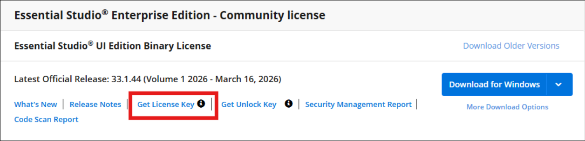
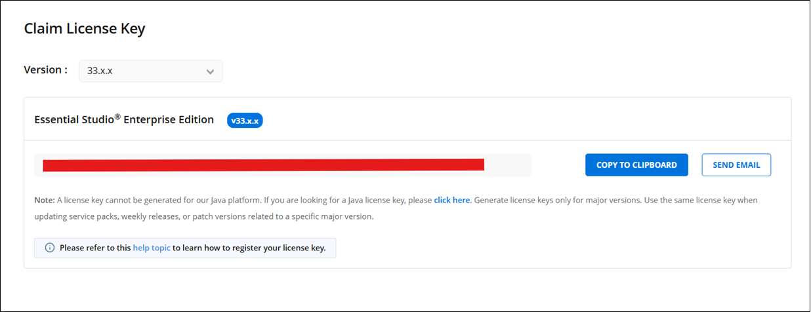
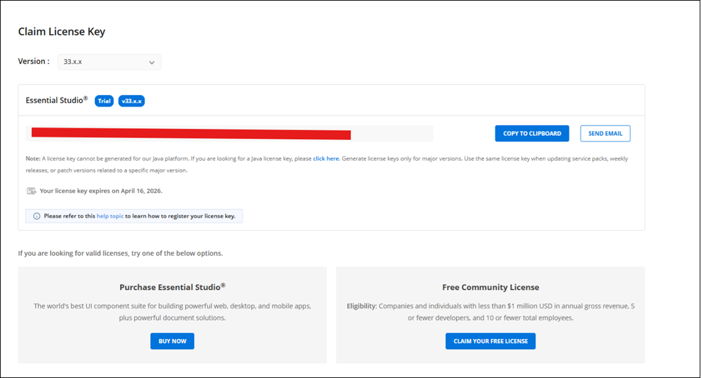
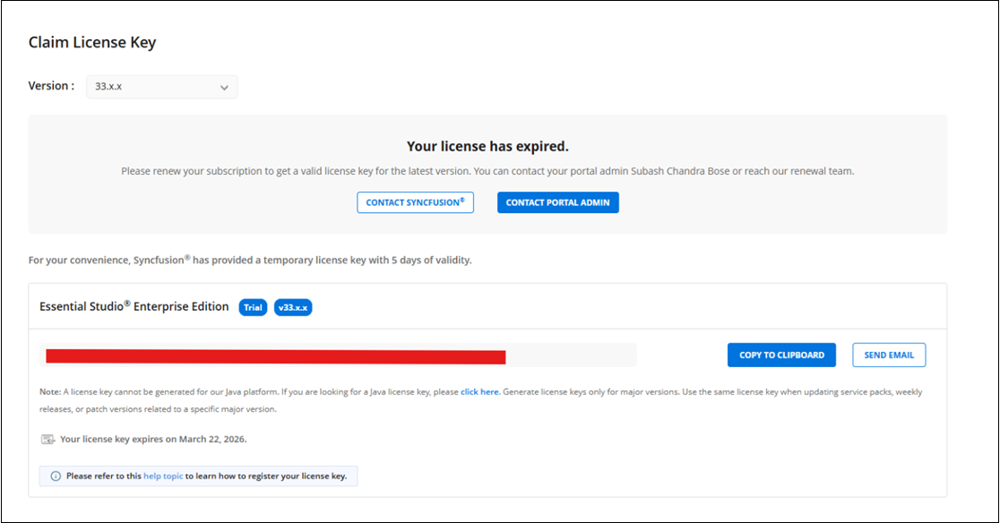
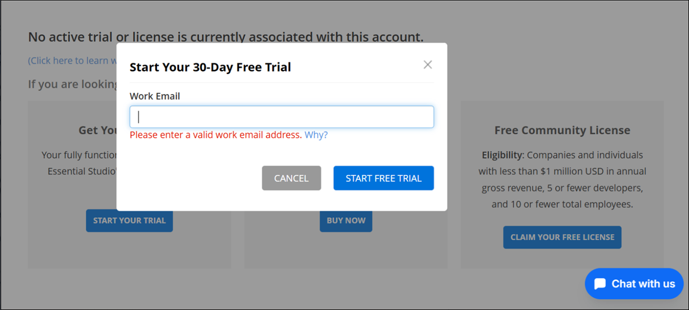

# Generate Syncfusion&reg; License key

License keys can be generated from the [License & Downloads](https://syncfusion.com/account/downloads) or [Trial & Downloads](https://www.syncfusion.com/account/manage-trials/downloads) section from your Syncfusion&reg; account. 

I> * Syncfusion&reg; license keys are **version‑specific and edition‑specific**, refer to the [KB](https://www.syncfusion.com/kb/8976/how-to-generate-license-key-for-licensed-products) to generate the license key for the required version and platform.
* **Previously (before v31.x)**, Syncfusion® generated license keys **per platform** (e.g., ASP.NET Core, Blazor, Windows, etc.).
* **Starting from v31.1.17 (2025 Volume 3 release)**, Syncfusion® introduced a new licensing model where license keys are generated **per edition rather than per platform**, and the editions include:
  - **Essential Studio UI Edition**
  - **Essential Studio Document SDK**
  - **Essential Studio PDF Viewer SDK**
  - **Essential Studio DOCX Editor SDK**
  - **Essential Studio Spreadsheet Editor SDK**
  - **Essential Studio Enterprise Edition** (includes all the above)

    
* Refer this [KB](https://www.syncfusion.com/kb/8951/which-version-syncfusion-license-key-should-i-use-in-my-application) to know about which version of the Syncfusion&reg; license key should be used in the application.

## Claim License key

Syncfusion&reg; License keys can also be generated from the **"Claim License Key"** page based on the trial or valid license associated with your Syncfusion&reg; account.

You can get the license key, based on license availability in your Syncfusion&reg; account.

### Active License

If you have a Syncfusion&reg; account associated with valid license, license key will be generated from claim license key page.

### Active Trial

If you have a Syncfusion&reg; account associated with valid trial license, license key will be generated from claim license key page with expiry date.

### Expired License

If you have a Syncfusion&reg; account with an expired license, your license subscription must be renewed in order to obtain a valid license key for the latest Essential&reg; Studio&reg; version. Meanwhile, a temporary license key with a 5-day validity period will be generated.

### No Trial or No License or Expired trial

**Personal Email Users:**
Start a trial via the ‘Start Your Trial’ after registering a work email.

**Corporate Email Users:**
A trial automatically starts with a work email, and a key is issued.

N> Refer to the [Usage and Features of Syncfusion Claim License Key Page](https://support.syncfusion.com/kb/article/18842/what-are-the-usage-and-features-of-syncfusion-claim-license-key-page#scenarios:) section for detailed instructions on claim license key process.

## See Also

* [How to Register Syncfusion&reg; License Key in the Application?](https://help.syncfusion.com/common/essential-studio/licensing/how-to-register-in-an-application)
