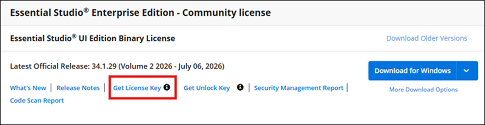
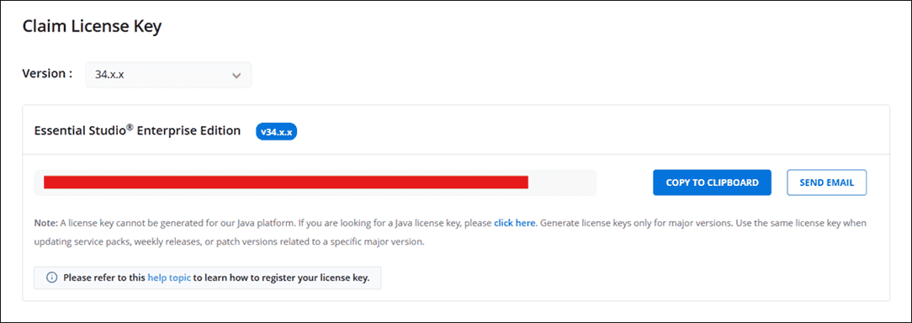
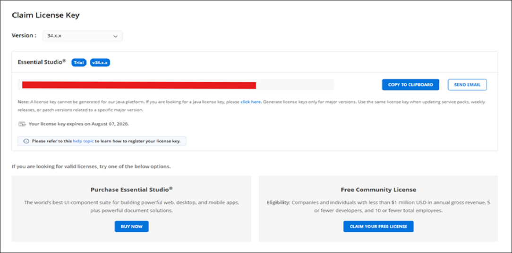
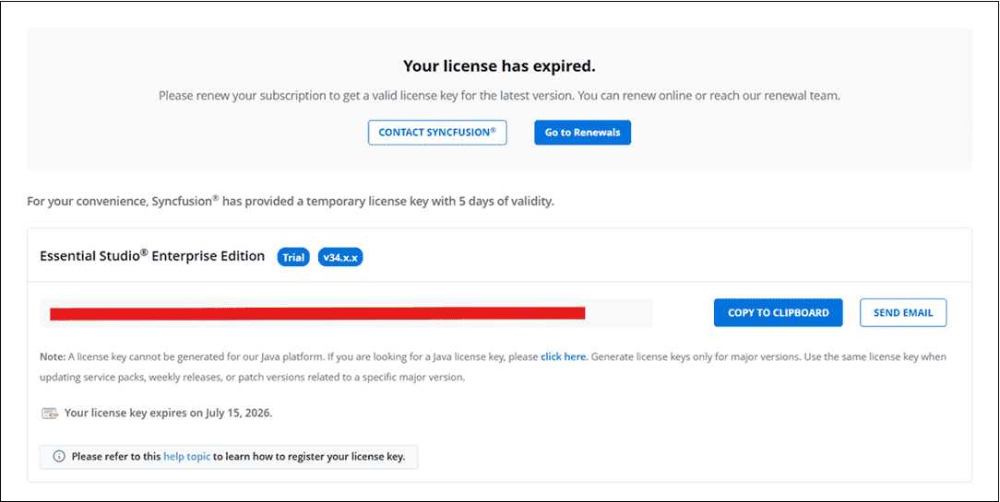
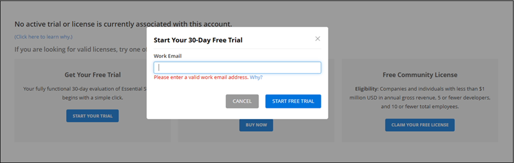

# Generate Syncfusion&reg; License Key

License keys can be generated from the **License & Downloads** or **Trial & Downloads** section of your Syncfusion&reg; account. Choose the path that matches your account status: active license, active trial, expired license, or no license/trial.

**Prerequisites:** A Syncfusion&reg; account is required. To start a trial, register with a verified work email address.

To generate a license key:

1. Sign in to your Syncfusion&reg; account.
2. Navigate to **License & Downloads** (or **Trial & Downloads** if on a trial).
3. Select the required version and platform (or edition for v31.1.17 and later).
4. Click **Generate License Key**.

I> * Syncfusion&reg; license keys are **version‑specific and edition‑specific**. Refer to the [KB](https://www.syncfusion.com/kb/8976/how-to-generate-license-key-for-licensed-products) for guidance on generating the license key for the required version and platform/edition.
* **Starting from v34.1.29 (2026 Volume 2 release)**, Syncfusion&reg; introduced Standalone UI SDKs offering individual component packages, including:
  - **Essential Studio Grid SDK**
  - **Essential Studio Chart SDK**
  - **Essential Studio Scheduler SDK**
  - **Essential Studio Gantt SDK**
  - **Essential Studio Rich Text Editor SDK**
  - **Essential Studio Diagram SDK**
  - **Essential Studio File Manager SDK**
* **Starting from v31.1.17 (2025 Volume 3 release)**, Syncfusion&reg; introduced a new licensing model where license keys are generated **per edition rather than per platform**, and the editions include:
  - **Essential Studio UI Edition**
  - **Essential Studio Document SDK**
  - **Essential Studio PDF Viewer SDK**
  - **Essential Studio DOCX Editor SDK**
  - **Essential Studio Spreadsheet Editor SDK**
  - **Essential Studio Enterprise Edition** (includes all the above)
* **Previously (before v31.x)**, Syncfusion&reg; generated license keys **per platform** (e.g., ASP.NET Core, Blazor, Windows, etc.). In other words, pre-v31 keys were version + platform, while v31+ keys are version + edition.
* Refer to the [KB](https://www.syncfusion.com/kb/8951/which-version-syncfusion-license-key-should-i-use-in-my-application) to know which version of the Syncfusion&reg; license key should be used in your application.

> **Note:** If your license has expired, the generated license key is a **temporary key with a 5-day validity period**. Renew your subscription to obtain a valid license key for the latest Essential Studio version.

## Claim License Key

In addition to the steps above, Syncfusion&reg; license keys can also be generated from the [**Claim License Key**](https://www.syncfusion.com/account/claim-license-key) page based on the trial or valid license associated with your Syncfusion&reg; account.

The license key is issued based on the license availability in your Syncfusion&reg; account.

### Claim License Key Scenarios

#### Active License

If you have a Syncfusion&reg; account associated with a valid license, the license key will be generated from the **Claim License Key** page.

### Active Trial

If you have a Syncfusion&reg; account associated with a valid trial license, the license key will be generated from the **Claim License Key** page with an expiry date. Syncfusion&reg; trials are typically valid for **30 days**.

### Expired License

If you have a Syncfusion&reg; account with an expired license, renew your license subscription to obtain a valid license key for the latest Essential Studio version. Meanwhile, a temporary license key with a **5-day validity period** will be generated.

### No Trial or No License or Expired trial

**Personal Email Users:**
Start a trial via the "Start Your Trial" option after registering with a work email.

**Corporate Email Users:**
A trial automatically starts with a work email, and a key is issued.

N> Refer to the [Usage and Features of Syncfusion Claim License Key Page](https://support.syncfusion.com/kb/article/18842/what-are-the-usage-and-features-of-syncfusion-claim-license-key-page#scenarios) section for detailed instructions on the claim license key process.

## See Also

* [How to Register Syncfusion&reg; License Key in the Application?](https://help.syncfusion.com/common/essential-studio/licensing/how-to-register-in-an-application)
