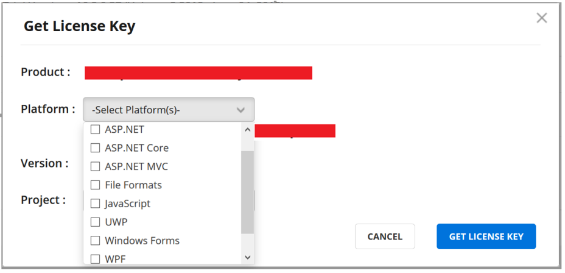

# Syncfusion Licensing Overview

## How to generate Syncfusion license key  

You can generate your license key from [Syncfusion.com](https://www.syncfusion.com/). This license key will be required to use our products in your application. If you have a licensed installer, this key is not required. If you are using our trial installer, you must include the license key in your application. 
 
N> License key will be applicable only after the release version 16.2. 

## License Key for Trial Users  

1.  You can generate the license key from [Trials & Downloads](https://www.syncfusion.com/account/manage-trials/downloads).
 
2.  In [Trials & Downloads](https://www.syncfusion.com/account/manage-trials/downloads), you will find only your current, active trial products. Trials which you have completed through both the [Free Trial](https://www.syncfusion.com/downloads) and [Start Trial](https://www.syncfusion.com/account/manage-trials/start-trials) pages are listed here.

3.	You can generate the license key for required product installer by clicking on Get License Key, as shown in the following screenshot. 

	
 
4.	After clicking Get License Key, a pop-up will be opened.

	
	
5.	The chosen product name will be displayed at the top. 

6.  You can select the required platforms in the Platform multi-select dropdown. License keys will be generated for the selected platforms.

	
	
7.  The platform-based section is only required when you have an Essential Studio trial license. If you have evaluated the studio license, you are eligible to use all platforms. 

8.  If you have evaluated individual products (platforms), you are only eligible for that platform and you can directly generate license key for that platform only. Refer to the following screenshot.

	
	
9.  You can only generate license keys for active trial versions which you are using.

10. Project name is optional. You can provide the name of the application to which you are going to apply the license key.

11. After clicking  GET LICENSE KEY, your license key will be generated, as shown in the following screenshot.

	
 
12. To register the downloaded license key to in your application, refer to this [help topic](https://help.syncfusion.com/common/essential-studio/licensing/license-key#how-to-register-the-syncfusion-license-key). 

## License Key for Licensed Users

1.  You can generate the license key for licensed products from [License & Downloads](https://www.syncfusion.com/account/downloads). 

2.  In [License & Downloads](https://www.syncfusion.com/account/downloads), you can find all your licensed products, both active and expired. 

3.  You can generate the license key for required product installer by clicking on Get License Key link (refer to the following screenshot). 

	
 
4.  After clicking Get License Key, a pop-up will be opened, as shown in the following screenshot.

	
 
5.  Product name will be displayed at the top. 

6.	You can select the required platforms in the Platform multi-select dropdown. License keys will be generated for selected platforms.

	
 
7.  The platform-based section is only required when you have an Essential Studio license. If you have studio license, you are eligible to use all platforms. 

8.  If you have an individual product (platform) license, you are only eligible for that platform, and you can directly generate license keys for that platform. Refer to the below screenshot, for more information.

	
	
9.  You only need license keys for release versions 16.2 and later.

10. Project name is optional. You can give the name of the application in which you’re going to include the license key.

11. After clicking on GET LICENSE KEY, your license key will be generated and shown. Refer to the following screenshot for more information.

	
 
12. To register the downloaded license key in your application, refer to this [help topic](https://help.syncfusion.com/common/essential-studio/licensing/license-key#how-to-register-the-syncfusion-license-key). 

## How to register the Syncfusion license key

