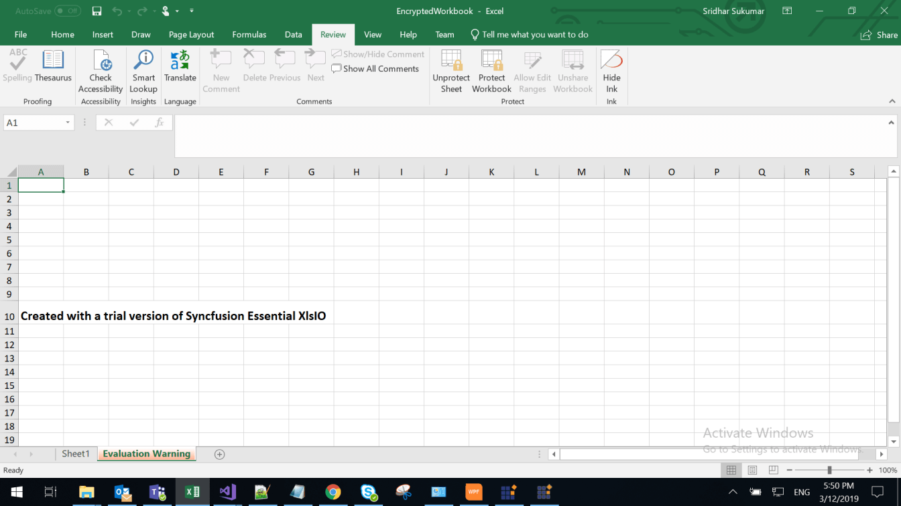

# Syncfusion Essential Studio Licensing Overview

We have introduced a new licensing system starting with version 16.2.0.x release of Essential Studio. These changes apply to all evaluators and only to paid customers who use NuGet packages from [nuget.org](https://www.nuget.org/). Starting with v16.2.0.x, if you reference Syncfusion assemblies from evaluation installer or from the NuGet feed, you also have to include a license key in your projects. Please note that this license key is different from the installer unlock key that you might have used in the past, and needs to be separately generated from Syncfusion website. A below licensing error will show if this license key is missing,

This application was built using a trial version of Syncfusion Essential Studio. Please include a valid license to permanently remove this license validation message. You can also obtain a free 30 day evaluation license to temporarily remove this message during the evaluation period. Please refer to this <a href="/common/essential-studio/licensing/license-key">help topic</a> for more information 

If you are using File-Format libraries, trial message will be displayed as watermark in the generated documents.

**Example**

N> This licensing system is not applicable for JavaScript (Essential JS 1 & Essential JS 2) script files (.js files). So, there is no need to apply license key anywhere in scripts or themes.

## How to generate Syncfusion license key

License keys can be generated from the [License & Downloads](https://syncfusion.com/account/downloads) or [Trail & Downloads](https://www.syncfusion.com/account/manage-trials/downloads) section of the Syncfusion website. 

As Syncfusion license key is **version and platform specific**, kindly follow the [KB](https://www.syncfusion.com/kb/8976/how-to-generate-license-key-for-licensed-products) to generate the license key for required version and platform. Also, refer to the [KB](https://www.syncfusion.com/kb/8951/which-version-syncfusion-license-key-should-i-use-in-my-application) to know which version Syncfusion license key should use in the application.

## How to register the Syncfusion license key

The generated license key is just a string that needs to be registered before any Syncfusion control is initiated. The following code is used to register the license.



Syncfusion.Licensing.SyncfusionLicenseProvider.RegisterLicense("YOUR LICENSE KEY");



N> Place the license key between double quotes.  Also, ensure that Syncfusion.Licensing.dll is referenced in your project where the license key is being registered.

Recommended place to register the license in the various platforms (ASP.NET Core, Xamarin, etc.) is covered in the following section.

### Windows Forms

Register the licensing code in static void main method before calling **Application.Run()** method in C#. In Visual Basic, register the licensing code in **Application.designer.vb** file constructor.



static void Main()
{
	//Register Syncfusion license
	Syncfusion.Licensing.SyncfusionLicenseProvider.RegisterLicense("YOUR LICENSE KEY");
	
    Application.EnableVisualStyles();
    Application.SetCompatibleTextRenderingDefault(false);
    Application.Run(new Form1());
}



Public Sub New()
		MyBase.New(Global.Microsoft.VisualBasic.ApplicationServices.AuthenticationMode.Windows)
		'Register Syncfusion License
		Syncfusion.Licensing.SyncfusionLicenseProvider.RegisterLicense("YOUR LICENSE KEY")
		Me.IsSingleInstance = False
		Me.EnableVisualStyles = True
		Me.SaveMySettingsOnExit = True
		Me.ShutdownStyle = Global.Microsoft.VisualBasic.ApplicationServices.ShutdownMode.AfterMainFormCloses
End Sub



 
### WPF

Register the license key in App constructor of **App.xaml.cs** in C#. If App constructor not available in **App.xaml.cs**, create the "App()" constructor in **App.xaml.cs** and register the license key inside the constructor. In Visual Basic, register the license code in **App.xaml.vb**.


public partial class App : Application
{
	public App()
	{
		//Register Syncfusion license
		Syncfusion.Licensing.SyncfusionLicenseProvider.RegisterLicense("YOUR LICENSE KEY");
	}	
} 



Private Sub New()
	'Register Syncfusion License
	Syncfusion.Licensing.SyncfusionLicenseProvider.RegisterLicense("YOUR LICENSE KEY")
End Sub




### ASP.NET	

Register the license key in Application_Start method of **Global.asax.cs/Global.asax**



void Application_Start(object sender, EventArgs e)
{
	//Register Syncfusion license
	Syncfusion.Licensing.SyncfusionLicenseProvider.RegisterLicense("YOUR LICENSE KEY");
	
	// Code that runs on application startup
	RouteConfig.RegisterRoutes(RouteTable.Routes);
	BundleConfig.RegisterBundles(BundleTable.Bundles);
}



Sub Application_Start(ByVal sender As Object, ByVal e As EventArgs)
	'Syncfusion Licensing Register
	Syncfusion.Licensing.SyncfusionLicenseProvider.RegisterLicense("YOUR LICENSE KEY")
	'Code that runs on application startup
	AuthConfig.RegisterOpenAuth()
	RouteConfig.RegisterRoutes(RouteTable.Routes)
	System.Web.Http.GlobalConfiguration.Configuration.Routes.MapHttpRoute(name:="DefaultApi", routeTemplate:="api/{controller}/{action}/{id}", defaults:=New With {.id = System.Web.Http.RouteParameter.[Optional]
	   })
End Sub




### ASP.NET MVC

Register the license key in Application_Start method of **Global.asax.cs/Global.asax.vb**



void Application_Start(object sender, EventArgs e)
{
	//Register Syncfusion license
	Syncfusion.Licensing.SyncfusionLicenseProvider.RegisterLicense("YOUR LICENSE KEY");
	
	// Code that runs on application startup
	RouteConfig.RegisterRoutes(RouteTable.Routes);
	BundleConfig.RegisterBundles(BundleTable.Bundles);
}



Protected Sub Application_Start()
        'Syncfusion Licensing Register
        Syncfusion.Licensing.SyncfusionLicenseProvider.RegisterLicense("YOUR LICENSE KEY")
        AreaRegistration.RegisterAllAreas()
        Register(GlobalConfiguration.Configuration)
        FilterConfig.RegisterGlobalFilters(GlobalFilters.Filters)
        RouteConfig.RegisterRoutes(RouteTable.Routes)
        BundleConfig.RegisterBundles(BundleTable.Bundles)
End Sub

	
 

### ASP.NET Core

Register the license key in Configure method of **Startup.cs**



// This method gets called by the runtime. Use this method to configure the HTTP request pipeline.
public void Configure(IApplicationBuilder app, IHostingEnvironment env, ILoggerFactory loggerFactory)
{
	//Register Syncfusion license
	Syncfusion.Licensing.SyncfusionLicenseProvider.RegisterLicense("YOUR LICENSE KEY");
	
	loggerFactory.AddConsole(Configuration.GetSection("Logging"));
	loggerFactory.AddDebug();

	...
	
}

 

### Blazor

#### **For Server side application**

Register the license key in Configure method of **Startup.cs**



// This method gets called by the runtime. Use this method to configure the HTTP request pipeline.
public void Configure(IApplicationBuilder app, IWebHostEnvironment env)
{
    //Register Syncfusion license
	Syncfusion.Licensing.SyncfusionLicenseProvider.RegisterLicense("YOUR LICENSE KEY");
	
    if (env.IsDevelopment())
    {
        app.UseDeveloperExceptionPage();
    }
    else
    {
        app.UseExceptionHandler("/Error");
        // The default HSTS value is 30 days. You may want to change this for production scenarios, see https://aka.ms/aspnetcore-hsts.
        app.UseHsts();
    }

    app.UseHttpsRedirection();
    app.UseStaticFiles();

    app.UseRouting();

    app.UseEndpoints(endpoints =>
    {
         endpoints.MapBlazorHub();
         endpoints.MapFallbackToPage("/_Host");
    });
}


 

#### **For Client side application**

Register the license key in main method of **Program.cs**



using Syncfusion.Blazor;
public static async Task Main(string[] args) 
{ 
    //Register Syncfusion license 
    Syncfusion.Licensing.SyncfusionLicenseProvider.RegisterLicense("YOUR LICENSE KEY");  
    var builder = WebAssemblyHostBuilder.CreateDefault(args); 
    builder.RootComponents.Add<App>("app");                               
    builder.Services.AddSyncfusionBlazor(); 
    await builder.Build().RunAsync(); 
} 


 

### UWP

Register the license key in **App.xaml.cs** constructor before InitializeComponent() in C#. If App constructor not available in **App.xaml.cs**, create the "App()" constructor in **App.xaml.cs** and register the license key inside the constructor. In Visual Basic, register the licensing code in **App.xaml.vb** file before OnLaunched event.



public App()
{
	//Register Syncfusion license
	Syncfusion.Licensing.SyncfusionLicenseProvider.RegisterLicense("YOUR LICENSE KEY");

	this.InitializeComponent();
	this.Suspending += OnSuspending;
}



Public Sub New()
	'Register Syncfusion License
	Syncfusion.Licensing.SyncfusionLicenseProvider.RegisterLicense("YOUR LICENSE KEY")
End Sub

Protected Overrides Sub OnLaunched(e As Windows.ApplicationModel.Activation.LaunchActivatedEventArgs)

...

End Sub




### Xamarin.Forms

Register the license key in **App.xaml.cs** constructor before InitializeComponent(). If App constructor not available in **App.xaml.cs**, create the "App()" constructor in **App.xaml.cs** and register the license key inside the constructor.



public App()
{
	//Register Syncfusion license
	Syncfusion.Licensing.SyncfusionLicenseProvider.RegisterLicense("YOUR LICENSE KEY");
	
	InitializeComponent();
	
	MainPage = new App1.MainPage();
}



N> If you are developing an application using Gorilla Player SDK, it is must to register the Syncfusion license key in Xamarin.Forms.Android, Xamarin.Forms.iOS, and Xamarin.Forms.UWP.
   Refer [this link](https://help.syncfusion.com/common/essential-studio/licensing/license-key#xamarinandroid) to register Syncfusion license key in Xamarin.Forms.Android
   Refer [this link](https://help.syncfusion.com/common/essential-studio/licensing/license-key#xamarinios) to register Syncfusion license key in Xamarin.Forms.iOS
   Refer [this link](https://help.syncfusion.com/common/essential-studio/licensing/license-key#uwp) to register Syncfusion license key in Xamarin.Forms.UWP

If you are using **Prism Framework** in your application, register the license key before InitializeComponent in OnInitialized method of **App.Xaml.cs**



protected override async void OnInitialized()
{
	//Register Syncfusion license
    Syncfusion.Licensing.SyncfusionLicenseProvider.RegisterLicense("YOUR LICENSE KEY");
 
    InitializeComponent();
 
    await NavigationService.NavigateAsync("NavigationPage/MainPage");
}



### Xamarin.Android

Register the license key in **OnCreate** override method of your main activity class before initializing any Syncfusion control.



protected override void OnCreate(Bundle savedInstanceState)
{
	//Register Syncfusion license
	Syncfusion.Licensing.SyncfusionLicenseProvider.RegisterLicense("YOUR LICENSE KEY");

	base.OnCreate(savedInstanceState);

	// Set our view from the "main" layout resource
	SetContentView(Resource.Layout.Main);
}


 

### Xamarin.iOS

Register the license key in **FinishedLaunching** override method of **AppDelegate.cs**



public override bool FinishedLaunching(UIApplication application, NSDictionary launchOptions)
{
	//Register Syncfusion license
	Syncfusion.Licensing.SyncfusionLicenseProvider.RegisterLicense("YOUR LICENSE KEY");

	// create a new window instance based on the screen size
	Window = new UIWindow(UIScreen.MainScreen.Bounds);

	// If you have defined a root view controller, set it here:
	// Window.RootViewController = myViewController;

	// make the window visible
	Window.MakeKeyAndVisible();

	return true;
} 



### Flutter

Register the license key in the **main method** of your example and import the ‘syncfusion_flutter_core/core.dart' library.



// Refer the core package
import 'package:syncfusion_flutter_core/core.dart';

void main() { 
// Register Syncfusion license 
SyncfusionLicense.registerLicense("YOUR LICENSE KEY"); 
return runApp(MyApp()); 
}



N> License key registration is not required for Flutter, if you are using v18.3.0.x or later.

### Java

Import ‘syncfusion.licensing' package and register the license key in the **main method** of your console application.



// Refer the licensing package
import com.syncfusion.licensing.*;

static void main() { 
// Register Syncfusion license 
SyncfusionLicenseProvider.registerLicense("YOUR LICENSE KEY"); 
}



N> License key registration is not required for Java before v19.1.

### JavaScript (Essential JS 1 and Essential JS 2)

Syncfusion License keys are not required for script files (.js files). For the following platforms, you can use the script files without registering the license keys.

#### **JavaScript (Essential JS 2)**

* Angular

* React

* Vue

* JavaScript (ES5)

* TypeScript & JavaScript (ES6)

#### **JavaScript (Essential JS 1)**

* AngularJS

* Angular

* Aurelia

* ReactJS

* TypeScript

* EmberJS

## Registering key in a User control that contains Syncfusion controls
We recommend registering the license key at application level as shown in the previous sections

## NuGet.org users without a Syncfusion account

If you have directly obtained Syncfusion assemblies from NuGet.org and do not have a Syncfusion account, follow the steps to obtain a free 30-day license key:

* Register for a free Syncfusion account [here](https://www.syncfusion.com/account/register)
* Go to the start trials [page](https://syncfusion.com/account/manage-trials/start-trials) and start a trial
* Finally proceed to the [Trail & Downloads section](https://www.syncfusion.com/account/manage-trials/downloads) to obtain the license key

