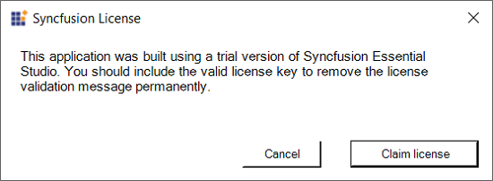
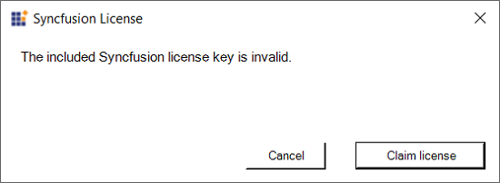
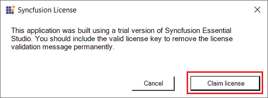
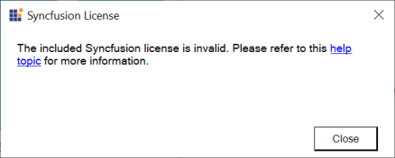
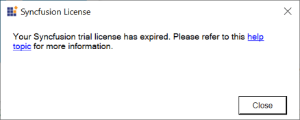
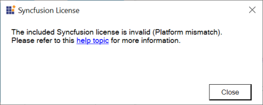
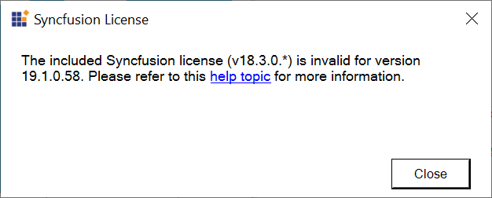

# Syncfusion Licensing Errors

Licensing error popup is displayed with various messages under different circumstances. Here are some ways to resolve different issues.

## Licensing errors 

### License key not registered\Trial Expired 

The following error message will be shown if a Syncfusion license key has not been registered in your application or if the trial key has expired after 30 days. 

**Error message:** This application was built using a trial version of Syncfusion Essential Studio. You should include the valid license key to remove the license validation message permanently.

**Solution:** 

* Generate a valid license key from here [Licensed users](https://www.syncfusion.com/account/downloads) or [Trial users](https://www.syncfusion.com/account/manage-trials/downloads) for a specific version and platform.

* In your application, register the generated license key. Please refer to this [help topic](https://help.syncfusion.com/common/essential-studio/licensing/how-to-register-in-an-application) for information on registering the license key.

### Invalid key

If the application is registered with an invalid key, another version of license key, or another platform's license key, the following error message will pop up when launching the application. 

**Error Message:** The included Syncfusion license key is invalid.

**Solution:**

* Generate a valid license key from here [Licensed users](https://www.syncfusion.com/account/downloads) or [Trial users](https://www.syncfusion.com/account/manage-trials/downloads) for a specific version and platform.

* In your application, register the generated license key. Please refer to this [help topic](https://help.syncfusion.com/common/essential-studio/licensing/how-to-register-in-an-application) for information on registering the license key.

### Claim License Key

Syncfusion License keys can be generated using **"Claim License"** button click from Syncfusion licensing warning message. If you click the claim license button, you will be navigated to Syncfusion claim license key page. License keys can be generated from Claim License Key page based on trial or valid license associated with your Syncfusion account.

Refer to this [help topic](https://help.syncfusion.com/common/essential-studio/licensing/claim-your-license-key) for more details.

Refer to the license key [generation](https://help.syncfusion.com/common/essential-studio/licensing/how-to-generate) and [registration](https://help.syncfusion.com/common/essential-studio/licensing/how-to-register-in-an-application) topic.

## Licensing errors from version 16.2.0* to 20.3.0*

### License key not registered 

The following error message will be shown if a Syncfusion license key has not been registered in your application. 

**Error message:** This application was built using a trial version of Syncfusion Essential Studio. Please include a valid license to permanently remove this license validation message. You can also obtain a free 30 day evaluation license to temporarily remove this message during the evaluation period. Please refer to this [help topic](https://help.syncfusion.com/common/essential-studio/licensing/licensing-errors#license-key-not-registered) for more information.

**Solution:** 

* Generate a valid license key from here [Licensed users](https://www.syncfusion.com/account/downloads) or [Trial users](https://www.syncfusion.com/account/manage-trials/downloads) for a specific version and platform.

* In your application, register the generated license key. Please refer to this [help topic](https://help.syncfusion.com/common/essential-studio/licensing/how-to-register-in-an-application) for information on registering the license key.

### Invalid key

If the application is registered with an invalid key, another version of license key, or another platform's license key, the following error message will pop up when launching the application. 

**Error Message:** The included Syncfusion license is invalid. Please refer to this [help topic](https://help.syncfusion.com/common/essential-studio/licensing/licensing-errors#invalid-key) for more information.

**Solution:**

* Generate a valid license key from here [Licensed users](https://www.syncfusion.com/account/downloads) or [Trial users](https://www.syncfusion.com/account/manage-trials/downloads) for a specific version and platform.

* In your application, register the generated license key. Please refer to this [help topic](https://help.syncfusion.com/common/essential-studio/licensing/how-to-register-in-an-application) for information on registering the license key.

### Trial Expired

The following error message will be shown if the trial key has expired after 30 days.

**Error Message:** Your Syncfusion trial license has expired. Please refer to this [help topic](https://help.syncfusion.com/common/essential-studio/licensing/licensing-errors#trial-expired) for more information.

**Solution:** Purchase from [here](https://www.syncfusion.com/sales/products) to get a valid Syncfusion license.

### Platform Mismatch

If the application is registered with another platform's license key, the following error message will pop up when launching the application.

**Error Message:** The included Syncfusion license is invalid (Platform mismatch). Please refer to this [help topic](https://help.syncfusion.com/common/essential-studio/licensing/licensing-errors#platform-mismatch) for more information.

**Solution:**

* Generate a valid license key from here [Licensed users](https://www.syncfusion.com/account/downloads) or [Trial users](https://www.syncfusion.com/account/manage-trials/downloads) for a specific version and platform.

* In your application, register the generated license key. Please refer to this [help topic](https://help.syncfusion.com/common/essential-studio/licensing/how-to-register-in-an-application) for information on registering the license key.

### Version Mismatch

If the application is registered with another version's license key, the following error message will pop up when launching the application.

**Error Message:** The included Syncfusion license ({Registered Version}) is invalid for version {Required version}. Please refer to this [help topic](https://help.syncfusion.com/common/essential-studio/licensing/licensing-errors#version-mismatch) for more information.

**Solution:**

* Generate a valid license key from here [Licensed users](https://www.syncfusion.com/account/downloads) or [Trial users](https://www.syncfusion.com/account/manage-trials/downloads) for a specific version and platform. Kindly follow the [KB](https://www.syncfusion.com/kb/8976/how-to-generate-license-key-for-licensed-products) to generate license key.

* In your application, register the generated license key. Please refer to this [help topic](https://help.syncfusion.com/common/essential-studio/licensing/how-to-register-in-an-application) for information on registering the license key.

## Could not load Syncfusion.Licensing.dll assembly version...?

Make sure that all the referenced Syncfusion assembles are of the same version. Try cleaning and rebuilding the application to resolve assembly conflict issues.
