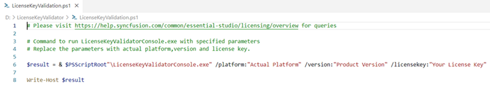
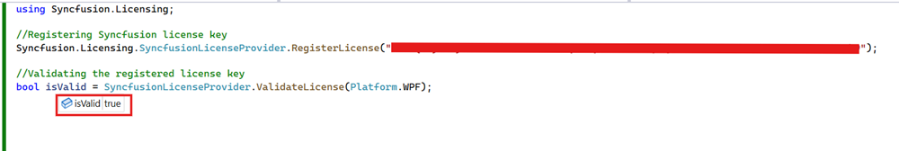

# Syncfusion&reg; license key validation in CI services

Syncfusion&reg; license key validation in CI services ensures that Syncfusion&reg; Essential Studio&reg; components are properly licensed during continuous integration processes. Validating the license key at the CI level prevents licensing errors during deployment by failing the build when the license key is invalid or the referenced assembly versions do not match the license key version.

The following section shows how to validate the Syncfusion&reg; license key in CI services.

* Download and extract the [LicenseKeyValidator.zip](https://s3.amazonaws.com/files2.syncfusion.com/Installs/LicenseKeyValidation/LicenseKeyValidator.zip) utility to a known location on the build agent (for example, `D:\LicenseKeyValidator`).

N> To generate a license key, refer to the [license key generation](https://help.syncfusion.com/common/essential-studio/licensing/how-to-generate) documentation.

* Open the LicenseKeyValidation.ps1 PowerShell script in a text or code editor, as shown in the example below.



# Replace the parameters with the desired platform, version, and actual license key.

$result = & "$PSScriptRoot\LicenseKeyValidatorConsole.exe" /platform:"WPF" /version:"26.2.4" /licensekey:"Your License Key"

Write-Host $result




* Update the parameters in the LicenseKeyValidation.ps1 script file as described below.

  **Platform:** Modify the value for `/platform:` to the desired platform. For reference, see the applicable example platforms below.

  **For versions 30.x and below:** Installers are organized by platforms and file formats.
  
     (e.g., "WindowsForms", "WPF", "WinUI", "UWP", "MAUI", "Xamarin", "Blazor", "FileFormats")

  **For version 31.1.17 or later:** Installers are organized by platforms, and the **'File Formats'** platform has been divided into multiple platforms to improve the installer experience.
  
     (e.g., "WindowsForms", "WPF", "WinUI", "UWP", "MAUI", "Blazor", "PDF", "Word", "Excel", "PowerPoint", "PDFViewer", "WordEditor", "SpreadsheetEditor")

     For more details on the platform breakdown, refer to this [KB](https://support.syncfusion.com/kb/article/21200/how-to-know-installer-changes--essential-studio-v31117).
  
  **Version:** Change the value for `/version:` to the required version (e.g., "26.2.4"). This must match the version of the Syncfusion&reg; assemblies referenced in the project.
  
  **License key:** Replace the value for `/licensekey:` with your actual license key (e.g., "Your License Key"). Wrap the key in double quotes.

N> * This feature is available only for the following Syncfusion&reg; Essential Studio&reg; platforms starting from version 16.2.0.41: WPF, Windows Forms, WinUI, UWP, MAUI, Xamarin, Blazor, FileFormats.
* When using specific converter controls (31.1.17 or later), set platform to one of the following: WordToPDF, ExcelToPDF, PowerPointToPDF. For more details, refer to this [KB](https://support.syncfusion.com/kb/article/21200/how-to-know-installer-changes--essential-studio-v31117).
* The build agent must have PowerShell 5.1 or later installed, and PowerShell script execution must be permitted (or the script must be invoked with `-ExecutionPolicy Bypass` when required).

## Azure Pipelines (YAML)

* Create a new [User-defined Variable](https://learn.microsoft.com/en-us/azure/devops/pipelines/process/variables?view=azure-devops&tabs=yaml%2Cbatch#user-defined-variables) named `LICENSE_VALIDATION` in the Azure Pipeline. Use the path of the LicenseKeyValidation.ps1 script file as a value (e.g., `D:\LicenseKeyValidator\LicenseKeyValidation.ps1`).

* Integrate the PowerShell task in the pipeline and execute the script to validate the license key.

The following example shows the syntax for Windows build agents.



pool:
  vmImage: 'windows-latest'

steps:
- task: PowerShell@2
  inputs:
    targetType: filePath
    filePath: $(LICENSE_VALIDATION) #Or the actual path to the LicenseKeyValidation.ps1 script.
  displayName: Syncfusion License Validation
  failOnStderr: true



## Azure Pipelines (Classic)

* Create a new [User-defined Variable](https://learn.microsoft.com/en-us/azure/devops/pipelines/process/variables?view=azure-devops&tabs=yaml%2Cbatch#user-defined-variables) named `LICENSE_VALIDATION` in the Azure Pipeline. Use the path of the LicenseKeyValidation.ps1 script file as a value (e.g., `D:\LicenseKeyValidator\LicenseKeyValidation.ps1`).

* Include the PowerShell task in the pipeline and execute the script to validate the license key.

## GitHub actions

* To execute the script in PowerShell as part of a GitHub Actions workflow, include a step in the workflow file (for example, `.github/workflows/build.yml`) and update the path to the LicenseKeyValidation.ps1 script file (e.g., `D:\LicenseKeyValidator\LicenseKeyValidation.ps1`).

The following example shows the syntax for validating the Syncfusion&reg; license key in GitHub Actions.



steps:
  - name: Syncfusion License Validation
    shell: pwsh
    run: |
      & "D:\LicenseKeyValidator\LicenseKeyValidation.ps1"



## Jenkins

* Create an [Environment Variable](https://www.jenkins.io/doc/pipeline/tour/environment) named `LICENSE_VALIDATION`. Use the path of the LicenseKeyValidation.ps1 script file as a value (e.g., `D:\LicenseKeyValidator\LicenseKeyValidation.ps1`).

* Include a stage in the Jenkins pipeline to execute the LicenseKeyValidation.ps1 script in PowerShell.

The following example shows the syntax for validating the Syncfusion&reg; license key on a Windows Jenkins agent.



pipeline {
    agent any
    environment {
        LICENSE_VALIDATION = 'D:\\LicenseKeyValidator\\LicenseKeyValidation.ps1'
    }
    stages {
        stage('Syncfusion License Validation') {
            steps {
                powershell "${env.LICENSE_VALIDATION}"
            }
        }
    }
}



## Validate the License Key by Using the ValidateLicense() Method

* Reference the `Syncfusion.Licensing` assembly (or install the [Syncfusion.Licensing](https://www.nuget.org/packages/Syncfusion.Licensing) NuGet package) in your project.

* Register the license key by calling the `RegisterLicense("License Key")` method with the license key. For applications that start up before any Syncfusion&reg; control is created, place this call in the application startup (for example, `App.xaml.cs`, `Program.cs`, or the `Main` method).

* Once the license key is registered, validate it by using the `ValidateLicense(Platform.WPF)` method. This ensures that the license key is valid for the platform and version you are using. For reference, see the following example.



using Syncfusion.Licensing;

//Register the Syncfusion&reg; license key
SyncfusionLicenseProvider.RegisterLicense("YOUR LICENSE KEY");

//Validate the registered license key
bool isValid = SyncfusionLicenseProvider.ValidateLicense(Platform.WPF);



N> The following is the list of platforms that can be passed to the ValidateLicense method:
* **Before 31.x.x (30.x and lower):** WindowsForms, WPF, ASPNETCore, ASPNETMVC, FileFormats, Xamarin, UWP, ASPNET, Blazor, WinUI, MAUI.
* **31.1.17 or later:** WindowsForms, WPF, ASPNETCore, ASPNETMVC, UWP, ASPNET, Blazor, WinUI, MAUI, PDF, Word, Excel, PowerPoint, WordToPDF, ExcelToPDF, PowerPointToPDF, PDFViewer, WordEditor, SpreadsheetEditor. For more details, refer to this [KB](https://support.syncfusion.com/kb/article/21200/how-to-know-installer-changes--essential-studio-v31117).

* If the ValidateLicense() method returns true, registered license key is valid and can proceed with deployment.

* If the ValidateLicense() method returns false, there will be invalid license errors in deployment due to either an invalid license key or an incorrect assembly or package version that is referenced in the project. Please ensure that all the referenced Syncfusion&reg; assemblies or NuGet packages are all on the same version as the license key’s version before deployment. 

## Validate the License Key by Using a Unit Test Project

* To create a unit test project in Visual Studio, choose **File -> New -> Project** from the menu. This opens a dialog for creating a new project. Filter the project type by **Test** or type **Test** as a keyword in the search box to find available unit test project templates. Select the test framework (such as MSTest, NUnit, or xUnit) that best suits your needs.

* For more details on creating unit test projects in Visual Studio, refer to the [Getting Started with Unit Testing guide](https://learn.microsoft.com/en-us/visualstudio/test/getting-started-with-unit-testing?view=vs-2022&tabs=dotnet%2Cmstest#create-unit-tests).

* Install the [Syncfusion.Licensing](https://www.nuget.org/packages/Syncfusion.Licensing) NuGet package in the unit test project, or reference `Syncfusion.Licensing.dll` from the Syncfusion&reg; installer.

* Register the license key by calling `SyncfusionLicenseProvider.RegisterLicense("Your License Key")` in the unit test project.

N> Place the license key between double quotes. The `Syncfusion.Licensing` assembly must be referenced in the project where `RegisterLicense` is invoked.

* Once the license key is registered, validate it by using the `ValidateLicense(platform, out var validationMessage)` method. This ensures that the license key is valid for the platform and version you are using.

* The following example demonstrates how to register and validate the license key in an NUnit unit test project.



using NUnit.Framework;
using Syncfusion.Licensing;

[TestFixture]
public class SyncfusionLicenseTests
{
    [Test]
    public void TestSyncfusionWPFLicense()
    {
        var platform = Platform.WPF;
        // Register the Syncfusion&reg; license key
        SyncfusionLicenseProvider.RegisterLicense("Your License Key");

        bool isValidLicense = SyncfusionLicenseProvider.ValidateLicense(platform, out var validationMessage);
        Assert.That(isValidLicense, Is.True,
            $"Validation failed for {platform}. Validation Message: {validationMessage}");

        // Log validation messages to TestContext output
        if (isValidLicense)
        {
            TestContext.Out.WriteLine(
                $"Platform {platform} is correctly licensed for version " +
                $"{typeof(SyncfusionLicenseProvider).Assembly.GetName().Version}");
        }
    }
}



* Once the unit test is executed, if the license key validation passes for the specified platform, output similar to the following is displayed in the Test Explorer window.

* If the license validation fails during unit testing, output similar to the following is displayed in the Test Explorer window.

* License validation fails because of an invalid license key, or because the assembly or package versions referenced in the project do not match the version of the license key. In such cases, verify that you are using a valid license key for the platform, and ensure the assembly or package versions referenced in the project match the license key's version.