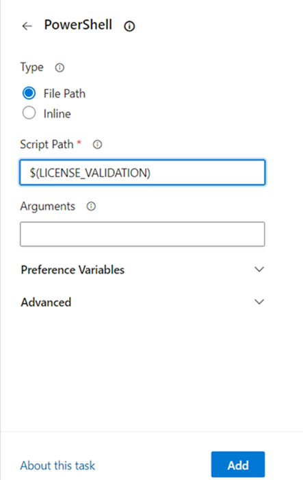
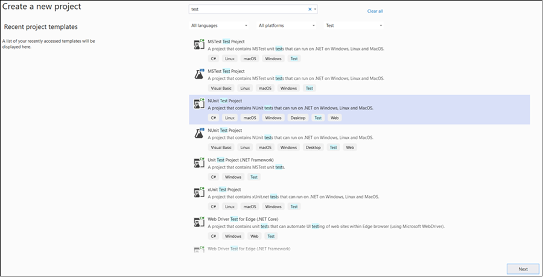
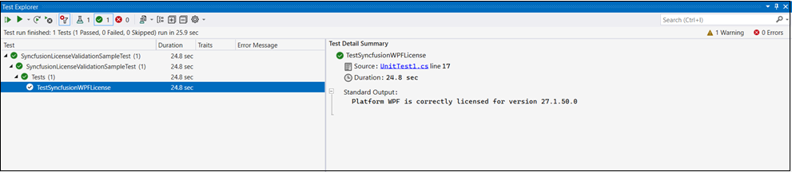
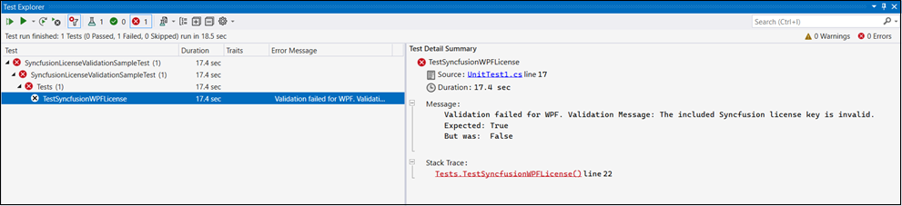

# Syncfusion&reg; license key validation in CI services

Syncfusion&reg; license key validation in CI services ensures that Syncfusion&reg; Essential Studio&reg; components are properly licensed during CI processes. Validating the license key at the CI level can prevent licensing errors during deployment. If validation fails, the CI process should fail. Re-validate the passed parameters and the registered license key to resolve the issue.

The following section shows how to validate the Syncfusion&reg; license key in CI services.

* Download and extract the LicenseKeyValidator.zip utility from the following link: [LicenseKeyValidator](https://s3.amazonaws.com/files2.syncfusion.com/Installs/LicenseKeyValidation/LicenseKeyValidator.zip). After extracting, the `LicenseKeyValidation.ps1` script and `LicenseKeyValidatorConsole.exe` will be available in the extracted folder.

* Open the LicenseKeyValidation.ps1 PowerShell script in a text/code editor as shown in the below example.



# Replace the parameters with the desired platform, version, and actual license key.

$result = & $PSScriptRoot"\LicenseKeyValidatorConsole.exe" /platform:"UIComponent" /version:"34.1.29" /licensekey:"Your License Key"

Write-Host $result



# Replace the parameters with the desired platform, version, and actual license key.

$result = & $PSScriptRoot"\LicenseKeyValidatorConsole.exe" /platform:"WPF" /version:"26.2.4" /licensekey:"Your License Key"

Write-Host $result



* Update the parameters in the LicenseKeyValidation.ps1 script file as described below. 

  **Platform:** Set the value of `/platform:` to the desired platform. For reference, please check the applicable example platforms below. 

  **34.1.29 or later:** Additional standalone UI SDK platforms have been introduced to provide developers' more flexibility in targeting specific UI capabilities.
  
     (e.g., "UIComponent", "PDF", "Word", "Excel", "PowerPoint", "PDFViewer", "WordEditor", "SpreadsheetEditor", "SchedulerSDK", "GanttSDK", "DiagramSDK", "RichTextEditorSDK", "GridSDK", "ChartSDK", "FileManagerSDK", "Markdown")
	 
	 For more details on the platform breakdown, refer to this [KB](https://support.syncfusion.com/kb/article/24203/how-to-know-installer-changes--essential-studio-v34129).

  **31.1.17 or later:** Installers were organized by platforms, and the **'File Formats'** platform has been divided into multiple platforms to improve the installer experience.
  
     (e.g., "WindowsForms", "WPF", "WinUI", "UWP", "MAUI", "Blazor", "PDF", "Word", "Excel", "PowerPoint", "PDFViewer", "WordEditor", "SpreadsheetEditor")

     For more details on the platform breakdown, refer to this [KB](https://support.syncfusion.com/kb/article/21200/how-to-know-installer-changes--essential-studio-v31117).

  **Before 31.x.x (30.x and lower):** Installers were organized by platforms and file formats.
  
     (e.g., "WindowsForms", "WPF", "WinUI", "UWP", "MAUI", "Xamarin", "Blazor", "FileFormats")
  
  **Version:** Set the value of `/version:` to the required version (e.g., "26.2.4").
  
  **License Key:** Replace the value of `/licensekey:` with your actual license key (e.g., "Your License Key"). 

N> * This feature is available only for the following Syncfusion&reg; Essential Studio&reg; platforms starting from version 16.2.0.41: WPF, Windows Forms, WinUI, UWP, MAUI, Xamarin, Blazor, FileFormats.
* When using specific converter controls (31.1.17 or later), set platform to one of the following: WordToPDF, ExcelToPDF, PowerPointToPDF. For more details, refer to this [KB](https://support.syncfusion.com/kb/article/21200/how-to-know-installer-changes--essential-studio-v31117).
* When using standalone UI SDK controls (34.1.29 or later), set platform to one of the following: SchedulerSDK, GanttSDK, DiagramSDK, RichTextEditorSDK, GridSDK, ChartSDK, FileManagerSDK, Markdown, UIComponent.

## Azure Pipelines (YAML)

* Create a new [User-defined Variable](https://learn.microsoft.com/en-us/azure/devops/pipelines/process/variables?view=azure-devops&tabs=yaml%2Cbatch#user-defined-variables) named `LICENSE_VALIDATION` in the Azure Pipeline. Use the path of the LicenseKeyValidation.ps1 script file as a value (e.g., D:\LicenseKeyValidator\LicenseKeyValidation.ps1).

* Integrate the PowerShell task in the pipeline and execute the script to validate the license key. 

The following example shows the syntax for Windows build agents.



pool:
  vmImage: 'windows-latest'

steps:

- task: PowerShell@2
  inputs:
    targetType: filePath
    filePath: $(LICENSE_VALIDATION) #Or the actual path to the LicenseKeyValidation.ps1 script.
  
  displayName: Syncfusion&reg; License Validation 



## Azure Pipelines (Classic)

* Create a new [User-defined Variable](https://learn.microsoft.com/en-us/azure/devops/pipelines/process/variables?view=azure-devops&tabs=yaml%2Cbatch#user-defined-variables) named `LICENSE_VALIDATION` in the Azure Pipeline. Use the path of the LicenseKeyValidation.ps1 script file as a value (e.g., D:\LicenseKeyValidator\LicenseKeyValidation.ps1).

* Include the PowerShell task in the pipeline and execute the script to validate the license key. 

## GitHub Actions

* To execute the script in PowerShell as part of a GitHub Actions workflow, use a Windows runner (for example, `windows-latest`) since the validation script depends on PowerShell. Include a step in the workflow file and update the path of the LicenseKeyValidation.ps1 script file (e.g., D:\LicenseKeyValidator\LicenseKeyValidation.ps1).

The following example shows the syntax for validating the Syncfusion&reg; license key in GitHub Actions.



  steps:
  - name: Syncfusion&reg; License Validation
    shell: pwsh
    run: |
	  ./path/LicenseKeyValidator/LicenseKeyValidation.ps1



## Jenkins

* Create an [Environment Variable](https://www.jenkins.io/doc/pipeline/tour/environment) named 'LICENSE_VALIDATION'. Use the path of the LicenseKeyValidation.ps1 script file as a value (e.g., D:\LicenseKeyValidator\LicenseKeyValidation.ps1).

* Include a stage in Jenkins to execute the LicenseKeyValidation.ps1 script in PowerShell. 

The following example shows the syntax for validating the Syncfusion&reg; license key in a Jenkins pipeline running on a Windows agent.



pipeline {
	agent any
	environment {
		LICENSE_VALIDATION = 'path\\to\\LicenseKeyValidator\\LicenseKeyValidation.ps1'
	}
	stages {
		stage('Syncfusion&reg; License Validation') {
			steps {
				sh 'pwsh ${LICENSE_VALIDATION}'
			}
		}
	}
}



## Validate the License Key Programmatically Using the ValidateLicense() Method

* Register the license key by calling the `RegisterLicense("Your License Key")` method with your license key. Ensure the `Syncfusion.Licensing` NuGet package (or `Syncfusion.Licensing.dll`) is referenced in the project.

* Once the license key is registered, it can be validated by calling the `ValidateLicense(Platform.WPF)` method, which returns a `bool` indicating whether the registered license key is valid for the specified platform and version. For reference, please check the following example.



using Syncfusion.Licensing;

// Register the Syncfusion license key
SyncfusionLicenseProvider.RegisterLicense("Your License Key");

// Validate the registered license key.
// The array overload allows validating against multiple platforms in a single call.
bool isValid = SyncfusionLicenseProvider.ValidateLicense(new[] { Platform.UIComponent });



using Syncfusion.Licensing;

// Register the Syncfusion license key
SyncfusionLicenseProvider.RegisterLicense("Your License Key");

// Validate the registered license key
bool isValid = SyncfusionLicenseProvider.ValidateLicense(Platform.WPF);



N> The following is the list of platforms that can be passed to the ValidateLicense method:
* **34.1.29 or later:** UIComponent, PDF, Word, Excel, PowerPoint, WordToPDF, ExcelToPDF, PowerPointToPDF, PDFViewer, WordEditor, SpreadsheetEditor, SchedulerSDK, GanttSDK, DiagramSDK, RichTextEditorSDK, GridSDK, ChartSDK, FileManagerSDK, Markdown.
  **Note:** From v34.1.29 onwards, use `Platform.UIComponent` for UI framework platforms such as WindowsForms, WPF, ASPNETCore, ASPNETMVC, UWP, Blazor, WinUI, and MAUI instead of passing each platform individually (e.g., `new[] { Platform.UIComponent }`).
* **31.1.17 or later:** WindowsForms, WPF, ASPNETCore, ASPNETMVC, UWP, ASPNET, Blazor, WinUI, MAUI, PDF, Word, Excel, PowerPoint, WordToPDF, ExcelToPDF, PowerPointToPDF, PDFViewer, WordEditor, SpreadsheetEditor. For more details, refer to this [KB](https://support.syncfusion.com/kb/article/21200/how-to-know-installer-changes--essential-studio-v31117).
* **Before 31.x.x (30.x and lower):** WindowsForms, WPF, ASPNETCore, ASPNETMVC, FileFormats, Xamarin, UWP, ASPNET, Blazor, WinUI, MAUI.

* If the `ValidateLicense()` method returns `true`, the registered license key is valid and you can proceed with deployment.

* If the `ValidateLicense()` method returns `false`, there will be invalid license errors in deployment due to either an invalid license key or an incorrect assembly or package version referenced in the project. Ensure that all referenced Syncfusion&reg; assemblies or NuGet packages are on the same version as the license key's version before deployment.

## Validate the License Key in a Unit Test Project

* To create a unit test project in Visual Studio, choose **File -> New -> Project** from the menu. This opens a new dialog for creating a new project. Filtering the project type by Test or typing Test as a keyword in the search option can help you to find available unit test projects. Select the appropriate test framework (such as MSTest, NUnit, or xUnit) that best suits your need.

* For more details on creating unit test projects in Visual Studio, refer to the [Getting Started with Unit Testing guide](https://learn.microsoft.com/en-us/visualstudio/test/getting-started-with-unit-testing?view=vs-2022&tabs=dotnet%2Cmstest#create-unit-tests).

* Refer the `Syncfusion.Licensing` NuGet package in the test project, then register the license key by calling the `RegisterLicense("Your License Key")` method in the unit test project.

N> * Place the license key between double quotes. Ensure that the `Syncfusion.Licensing` NuGet package is referred in the project where the license key is being registered.

* Once the license key is registered, it can be validated by calling the `ValidateLicense(Platform.WPF, out var validationMessage)` method, which also returns a descriptive message via the `out` parameter. This ensures that the license key is valid for the platform and version you are using.

* For reference, please check the following example that demonstrates how to register and validate the license key in the unit test project.



public void TestSyncfusionWPFLicense()
{
	var platform = Platform.WPF;
	// Register the Syncfusion&reg; license key
	SyncfusionLicenseProvider.RegisterLicense("Your License Key");

	bool isValidLicense = SyncfusionLicenseProvider.ValidateLicense(platform, out var validationMessage);
	Assert.That(isValidLicense, Is.True, $"Validation failed for {platform}." + $" Validation Message: {validationMessage}");

	// Log validation messages to TestContext output
	if (isValidLicense)
	{
		TestContext.Out.WriteLine($"Platform {platform} is correctly licensed for version " + $"{typeof(SyncfusionLicenseProvider).Assembly.GetName().Version}");
	}
}



* Once the unit test is executed, if the license key validation passes for the specified platform, the output similar to the following will be displayed in the Test Explorer window.

* If the license validation fails during unit testing, the following output will be displayed in the Test Explorer window.

* License validation fails due to either an invalid license key or an incorrect assembly or package version that is referenced in the project. In such cases, verify that you are using the valid license key for the platform, and ensure the assembly or package versions referenced in the project match the version of the license key.