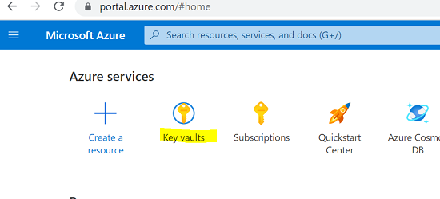
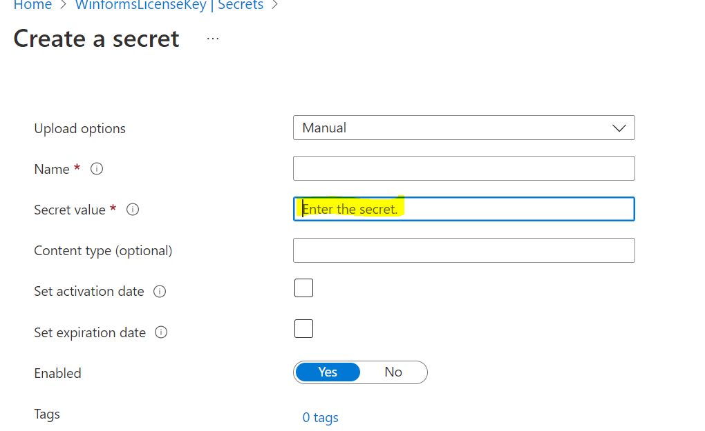
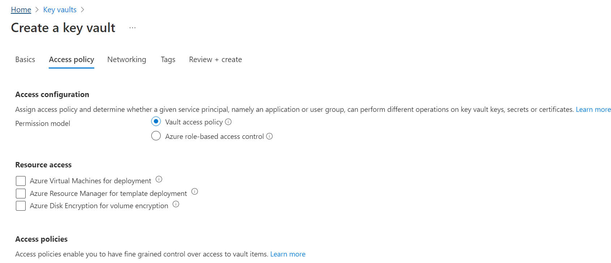
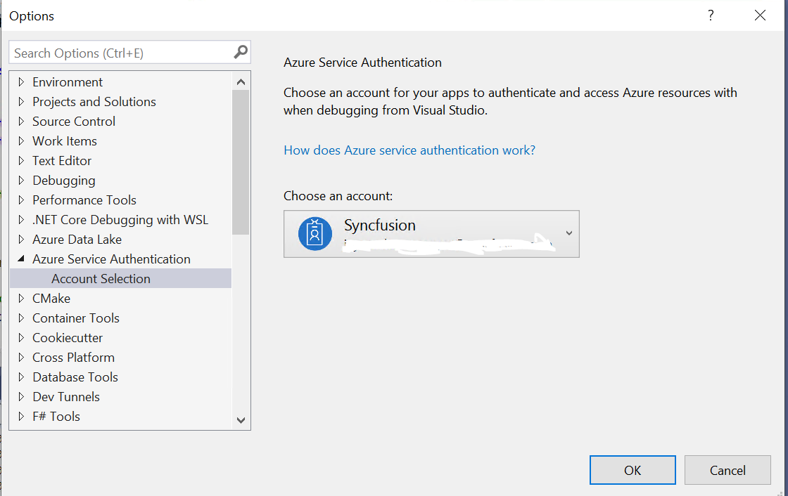

# How to Securely Store and Use Syncfusion&reg; License Keys in Azure Key Vault?

You can store the Syncfusion&reg; license key in Azure Key Vault and register it in your application.

## Prerequisites

* An active Azure subscription.
* A Syncfusion&reg; account with a valid license key.

To use the secret (Syncfusion&reg; License Key) stored in Azure Key Vault in your application, you can follow these general steps:

## Create an Azure Key Vault and store your secret

* Sign in to the [Azure portal](https://portal.azure.com/) and navigate to the **Key Vault** service.

* Create a new Key Vault or select an existing one.

* Add a secret to the Key Vault. For the **Name**, use a descriptive identifier such as `SyncfusionLicenseKey`, and paste your Syncfusion&reg; license key in the **Secret value** field.

## Grant your application access to the Key Vault and the secrets it requires

* In the Key Vault settings, add an access policy for your application with **Get** and **List** secret permissions. This policy defines the permissions your application has for accessing secrets in the Key Vault.

  > Azure now recommends using the Azure RBAC model instead of access policies for new deployments. For more details, see the [Azure RBAC vs access policy documentation](https://learn.microsoft.com/en-us/azure/key-vault/general/rbac-access-policy).

* If you're using an Azure-hosted application, assign an Azure Managed Identity to your application and use it to access the Key Vault. This is a secure way to authenticate your application without managing any credentials.

Refer to the documentation for [Vault access policy](https://learn.microsoft.com/en-us/azure/key-vault/general/security-features?WT.mc_id=Portal-Microsoft_Azure_KeyVault#access-model-overview).

 
## Modify your application code to retrieve the secrets from the Key Vault

* Use the Azure Key Vault client library to connect to the Key Vault and retrieve the secrets you need. The client library provides a simple and secure way to authenticate to the Key Vault, access secrets, and manage secret rotation and versioning.

* Depending on the programming language and framework of your application, you can use the Azure Key Vault client library for .NET, Java, Python, or any other supported language.

Refer to the following code snippet for more details.

	using Azure.Identity;
	using Azure.Security.KeyVault.Secrets;
	
	// Replace with your Key Vault URL and secret name
	string vaultUrl = "https://my-key-vault.vault.azure.net/";
	string secretName = "my-secret";
	
	// Authenticate to Azure using the default credentials
	var credential = new DefaultAzureCredential();
	
	// Create a new Key Vault client
	var client = new SecretClient(new Uri(vaultUrl), credential);
	
	// Retrieve the secret by name
	KeyVaultSecret secret = client.GetSecret(secretName);
	
	// Access the value of the secret
	string secretValue = secret.Value;
	
	// Use the secret value in your application
	Syncfusion.Licensing.SyncfusionLicenseProvider.RegisterLicense(secretValue);
Refer to the documentation for the [Azure Identity Client Library](https://learn.microsoft.com/en-us/dotnet/api/overview/azure/identity-readme?view=azure-dotnet).

N> You will need to have the necessary NuGet packages installed, such as **Azure.Identity** and **Azure.Security.KeyVault.Secrets**, and you may need to configure your Azure Key Vault access policies to allow your application to access the secrets.

By following these steps, you can securely and reliably store the Syncfusion&reg; license key in Azure Key Vault and use it in your application.
