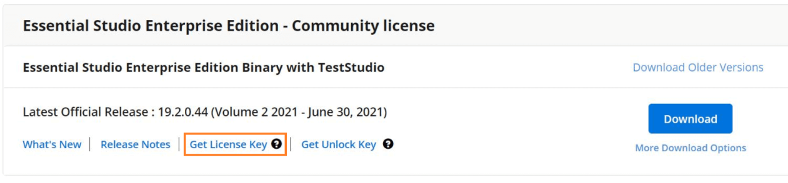

# Where can I get a license key?

License keys can be generated from the [License & Downloads](https://syncfusion.com/account/downloads) or [Trail & Downloads](https://www.syncfusion.com/account/manage-trials/downloads) section of the Syncfusion website. 

Kindly follow the [KB](https://www.syncfusion.com/kb/8976/) to generate the license key for required version and platform.

