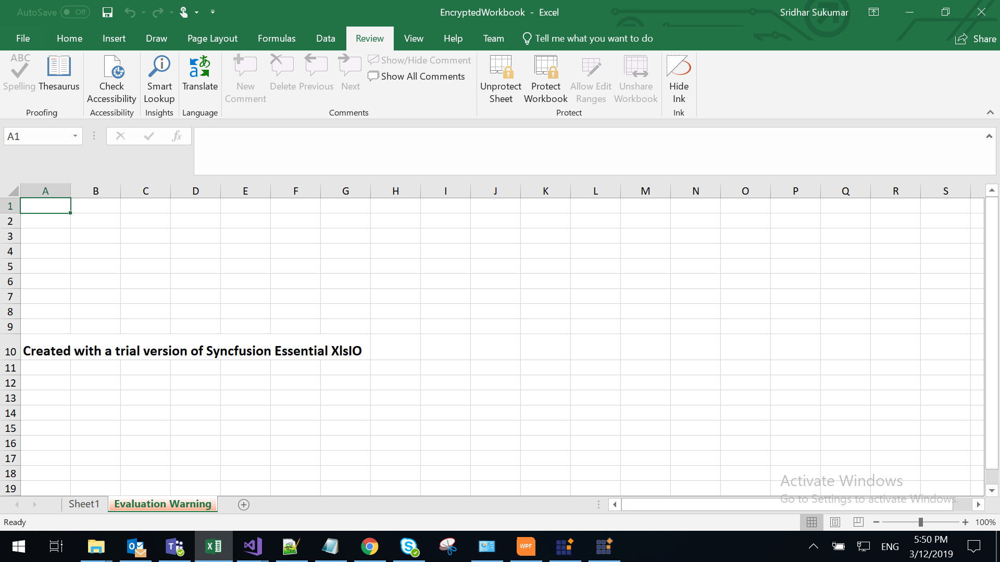

<style>
#license {
    font-size: .88em !important;
    margin-top: 1.5em;
    margin-bottom: 1.5em;
    background-color: #fbefca;
    padding: 10px 17px 14px;
}
</style>


# Syncfusion<sup style="font-size:70%">&reg;</sup> Licensing Overview

Starting with the version 16.2.0.x release of Essential Studio<sup style="font-size:70%">&reg;</sup>, Syncfusion<sup style="font-size:70%">&reg;</sup> introduced a new licensing system. These modifications apply to all evaluators (trial users) and to paid customers who reference Syncfusion<sup style="font-size:70%">&reg;</sup> assemblies through the [nuget.org](https://www.nuget.org/) feed. Starting with v16.2.0.x, if you use the trial installer or the NuGet feed to reference Syncfusion<sup style="font-size:70%">&reg;</sup> assemblies, you must also include the corresponding version license key in your projects.

The Syncfusion License Key is a unique string that must be registered in your application before initializing any Syncfusion controls. Registering the license key ensures that your application runs without licensing validation messages when using Syncfusion assemblies or NuGet packages.

N> The Syncfusion<sup style="font-size:70%">&reg;</sup> Installer Unlock Key is used only for installing the Syncfusion offline installer. This key typically starts with @ and ends with =. It should not be registered in your application.

The following licensing error is displayed if the license key is not registered in your projects while using assemblies from the evaluation installer or from nuget.org.

<div id="license">

This application was built using a trial version of Syncfusion Essential Studio. To remove the license validation message permanently, a valid license key must be included.

</div>

If you are using Documentation solutions libraries, the trial message is displayed as a watermark in the generated documents.

**Example:** Trial watermark rendered in a generated PDF document.



## Registering the license key in your application

The license key is a runtime string that must be registered before any Syncfusion<sup style="font-size:70%">&reg;</sup> control is initialized. A minimal registration call is shown below.

**Registering a single license key (C#)**

```csharp
Syncfusion.Licensing.SyncfusionLicenseProvider.RegisterLicense("YOUR_LICENSE_KEY");
```

Starting with v31.1.17, if your application uses components from multiple editions (for example, the UI Edition **and** the PDF Viewer SDK), register each generated license key. Refer to [How to Register the License Key in the Application](https://help.syncfusion.com/common/essential-studio/licensing/how-to-register-in-an-application) for the complete set of platforms (ASP.NET Core, Blazor, JavaScript, Java, etc.) and placement guidance (startup, Main, appsettings.json, environment variable).

## Registering Syncfusion<sup style="font-size:70%">&reg;</sup> license keys in a build server

| Source of Syncfusion<sup style="font-size:70%">&reg;</sup> assemblies | Details | License key needs to be registered? | Where to get the license key from |
| ------------- | ------------- | ------------- | ------------- |
| **NuGet package** | If the Syncfusion<sup style="font-size:70%">&reg;</sup> assemblies used in the build server are obtained from Syncfusion<sup style="font-size:70%">&reg;</sup> NuGet packages, you do not need to install any Syncfusion<sup style="font-size:70%">&reg;</sup> installer. Reference the required Syncfusion<sup style="font-size:70%">&reg;</sup> NuGet packages directly from [nuget.org](https://www.nuget.org/). When using NuGet packages from [nuget.org](https://www.nuget.org/packages?q=syncfusion), register the Syncfusion<sup style="font-size:70%">&reg;</sup> license key in the application. | Yes | Use any developer license to [generate](https://help.syncfusion.com/common/essential-studio/licensing/how-to-generate) keys for build environments. |
| **Trial installer** | If the Syncfusion<sup style="font-size:70%">&reg;</sup> assemblies used in the build server are obtained from the trial installer, register the license key in the application for the corresponding version and platform to avoid the trial license warning. | Yes | Use any developer trial license to [generate](https://help.syncfusion.com/common/essential-studio/licensing/how-to-generate) keys for build environments. |
| **Licensed installer** | If the Syncfusion<sup style="font-size:70%">&reg;</sup> assemblies used in the build server are obtained from the licensed installer, you do not need to register the license keys. You can [download](https://help.syncfusion.com/common/essential-studio/installation/web-installer/how-to-download#download-the-license-version) and [install](https://help.syncfusion.com/common/essential-studio/installation/web-installer/how-to-install) the licensed version of our installer. | No | Not applicable |

## See Also

* [How to Generate Syncfusion<sup style="font-size:70%">&reg;</sup> Essential Studio<sup style="font-size:70%">&reg;</sup> License Key](https://help.syncfusion.com/common/essential-studio/licensing/how-to-generate)
* [How to Register Syncfusion<sup style="font-size:70%">&reg;</sup> License Key in the Application](https://help.syncfusion.com/common/essential-studio/licensing/how-to-register-in-an-application)
* [Syncfusion<sup style="font-size:70%">&reg;</sup> Licensing Errors and Resolutions](licensing-errors.md)
