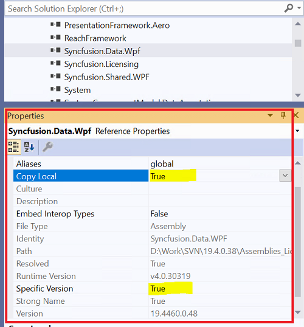

# How to Upgrade the Project into a New Syncfusion&reg; Version? 

## Upgrade the Project Using Project Migration Tool

Syncfusion&reg; provides project migration tool for the platforms listed below.

<table>
<tr>
<th>Platform</th>
<th>Guidelines for migrating the projects to latest Syncfusion&reg; version</th>
</tr>
<tr>
<td>Blazor</td>
<td><a href="https://help.syncfusion.com/extension/blazor-extension/visual-studio/upgrade-project" target="_top">Blazor Migration using Visual Studio</a> <a href="https://help.syncfusion.com/extension/blazor-extension/visual-studio-code/upgrade-project" target="_top">Blazor Migration using Visual Studio Code</a></td>
</tr>
<tr>
<td>ASP.NET Core (Essential JS 2)</td>
<td><a href="https://help.syncfusion.com/extension/aspnetcore-essentialjs2-extension/project-migration" target="_top">ASP.NET Core - JS 2 Migration</a></td>
</tr>
<tr>
<td>ASP.NET MVC (Essential JS 2)</td>
<td><a href="https://help.syncfusion.com/extension/aspnetmvc-essentialjs2-extension/project-migration" target="_top">ASP.NET MVC - JS 2 Migration</a></td>
</tr>
<tr>
<td>Windows Forms</td>
<td><a href="https://help.syncfusion.com/common/essential-studio/utilities#for-desktop-platforms" target="_top">Windows Forms Migration</a></td>
</tr>
<tr>
<td>WPF</td>
<td><a href="https://help.syncfusion.com/common/essential-studio/utilities#for-desktop-platforms" target="_top">WPF Migration</a></td>
</tr>
<tr>
<td>Universal Windows</td>
<td><a href="https://help.syncfusion.com/common/essential-studio/utilities#for-desktop-platforms" target="_top">Universal Windows Migration</a></td>
</tr>
</table>

## Upgrading the Projects Manually

You can upgrade the project in two methods, based on the procedure used in your project, to reference the Syncfusion&reg; assemblies. They are:

### CopyLocal=True

1. Set the SpecificVersion to False.
2. Remove the bin and obj folders in your local project directory.
3. Replace the latest assemblies with the upgraded assemblies in the local folder of your project.
4. Recompile the project.

### CopyLocal=False

1. Ensure that the old Syncfusion&reg; assemblies are removed from GAC.
   * For 2.0 and 3.5 assemblies: (C:\windows\assembly)
   * For 4.0, 4.5, and 4.5.1 assemblies: (C:\Windows\Microsoft.NET\assembly\GAC_MSIL)
2. Install the latest Syncfusion&reg; assemblies on your machine using the Syncfusion&reg; Assembly Manager.
3. Set the SpecificVersion to False.
4. Recompile your project; the latest assemblies from GAC refer to your project automatically. 
   
   

N> This method is only applicable to the platforms listed below, for which the Syncfusion&reg; assemblies will be installed in GAC.
 
* WPF
* Windows Forms

### Switching the Framework Version While Upgrading the Project

When you want to switch the Framework version while upgrading the project, use the Multi-Target Manager from the Syncfusion&reg; Dashboard.

After switching the Framework version using Multi-Target Manager, remove the bin and obj folders from your local project directory, and then recompile your project.

For more details about Multi-Target Manager, refer to [Multi-Target Manager](http://help.syncfusion.com/common/essential-studio/utilities#multi-target-manager).

### Migrating the Resource Files

Follow the given steps to move the resource files (.resx) of your project to the newer version:

1. Open Start > Syncfusion&reg; > Essential Studio&reg; x.x.x.x > Utilities > Migration > ConvertResx(Framework 2.0,3.5 or 4.0).
2. Click the Choose ResX Files to convert.
3. Select the Resx files you want to convert.
4. Click Start Converting Files.
5. After the conversion, the new Resx files should have the same name as the original files. Copies of the original files have the old suffix added to their names.
