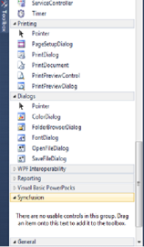
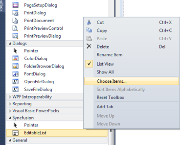
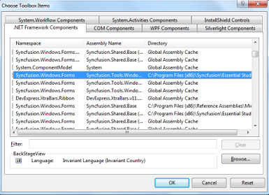

# How to configure the Toolbox of Visual Studio Manually?

The following are the steps to load the Syncfusion controls in toolbox of Visual Studio by configuring the toolbox.

## Toolbox Configuration Utility

To configure the toolbox using Toolbox Configuration Utility, refer to [Toolbox Configuration](/common/essential-studio/utilities#toolbox-configuration).

## Manually Configuring VS Toolbox

The following are the steps to configure VS Toolbox manually for Syncfusion tools:

1. Close all Visual Studio running instances.
2. Remove the *.tbd files except the toolbox.tbd from the following location:

   Windows XP: 

   C:\Documents and Settings\(user name)\Local Settings\Application Data\Microsoft\VisualStudio\10.0

   Vista/Windows 7:

   C:\Users\(user name)\AppData\Local\Microsoft\VisualStudio\10.0

    N> It takes some time to configure the toolbox and create tbd files when you load the toolbox in VS2010 initially.

3. Re-open the Visual Studio environment. The VSToolbox is configured.

### Adding Syncfusion controls in the Customized Toolbox:

The following are the steps to add the Syncfusion controls in the user-customized toolbox:

1. Open Visual Studio and create a new tab named Syncfusion in the toolbox.

   

2. Right-click and select Choose Items.

   

3. The Choose Toolbox Items window opens.

   

4. Select all the Syncfusion assemblies and then click OK. Assemblies are copied to the newly created Syncfusion Toolbox tab. 
