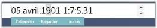
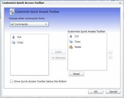

# How to implement Localization Support?

Syncfusion&reg; Essential Studio&reg;  products enable you to customize the application, specific to the language and culture of a particular country or region. 

## WPF

You can use this satellite assembly to utilize the localization support for your culture. The following steps help you extract the resource strings to a .csv file using the LocBaml.exe file, as a major part of enabling localization.

The Syncfusion.Tools.WPF.Resources.dll is sufficient to generate the localization support for the Syncfusion&reg;  controls. This assembly is available in the following installation location:

**Location:** {Installed_location}\Syncfusion\Essential Studio\<Version Number>\Assemblies\3.5

1.  Download the LocBaml.exe file from the following location:
    
	

2.  Copy the EXE file and the Syncfusion.Tools.WPF.Resources.dll to the following location:

    &lt;Your Application&gt;\bin\Debug\en-US 

3.  Open the Command Prompt and navigate to the same directory.

4.  Use the following command to generate the .csv file from the existing Syncfusion.Tools.WPF.Resources.dll:

    (Your Application)\bin\Debug\en-US \LocBaml /parse Syncfusion.Tools.WPF.Resources.dll /out:resourceStrings.csv

    N> The .csv files can be edited via Microsoft Excel or Notepad. This file contains string resources with the default text in the English language.

5.  Open the .csv file using Microsoft Excel or Notepad, and change the texts based on your culture. 

    The following illustrates customization from English to French.

    

6.  Generate the localized satellite assembly using the modified .csv file and install in the application. 
7.  Open Command Prompt, and navigate to the en-US directory. 
8.  Create another directory fr-CH under Bin\Debug folder using the fr-CH command.

    N> The Directory name should follow a proper culture name.

9.  Generate your own culture-specific assembly using the following command from en-US folder:

    LocBaml /generate /tran: resourceStrings.csv /out:../fr-CH /cul:fr-CH Syncfusion.Tools.WPF.Resources.dll

    Now you can see the generated satellite assembly under the fr-CH folder. 

10. Run your application with the CurrentUICulture as fr-CH in the App.xaml files as shown in the following code:



public App()

{

Thread.CurrentThread.CurrentUICulture = new System.Globalization.CultureInfo("fr-FR");

Thread.CurrentThread.CurrentCulture = new System.Globalization.CultureInfo("fr-FR");

}



At the end of this process, the application should contain the following to achieve localization: 

* Your Application.exe file
* The en-US directory with Resources.dll
* The fr-CH directory with corresponding Resources.dll and Syncfusion&reg;  Assemblies, when you have set CopyLocal to True.

#### Calendar control in French language

The following image illustrates Calendar control in the French language.

 N> * Localized strings are not displayed in your application until the created satellite assembly is signed. Send in your newly created assemblies for signing. Your assemblies are signed and sent immediately.
 * It is not required to install satellite assemblies in the GAC or Assemblies folder.
 * Your en-US directory should contain the default satellite assembly, available in the Precompiled Assemblies or Assemblies folder.
 * Application culture change should be included before the InitializeComponent() method call in the application. It is better to include culture change in the App.xaml file.

## Silverlight

In Silverlight, the easiest way to accomplish localization is to use a Resource (.resx) file. For each culture you want to target, you need a separate set of resources that match that specific culture. 

The following are the primary steps for localizing the Syncfusion&reg;  Ribbon Control.

* Add Resources for different cultures.
* Add supported cultures.
* Assign a Current UI Culture to the application.

### Add Resources

To localize Syncfusion&reg;  Silverlight controls, you need to create resource files for each culture. 

The following steps illustrate this:

1. Add Resource (.resx) files in the Resources folder for different cultures. Here, .resx files in a different culture or invariant culture should be placed in the Resources folder of your project.
2. Resource files should be named as AssemblyName.CultureName.resx and AssemblyName.resx for the invariant culture, where
   * **AssemblyName** – Syncfusion&reg;  Silverlight Control Assembly Name.
   * **CultureName** – Culture Code of the resource that you want to show in the UI. 

When your conversion is only for the invariant culture, the .resx file does not have to contain a culture suffix.

**Example:**

* Syncfusion.Ribbon.Silverlight.fr-FR.resx – French resource for Syncfusion.Ribbon.Silverlight assembly.
* Syncfusion.Ribbon.Silverlight.resx – Invariant Culture resource for Syncfusion.Ribbon.Silverlight assembly.

### Add Supported Cultures

It is very important to add supported cultures in the sample application project before you run the application.

Follow the steps provided to localize strings for your culture:

1. In the Solution Explorer, right-click your sample application project and choose Unload Project. The project is unavailable.
2. Right-click the project again, and select the Edit_SampleProjectName.csproj option.
3. In the .csproj file, find the &lt;SupportedCultures&gt; &lt;/SupportedCultures&gt; tags. By default, the tags are empty. So, add the cultures that you want to be supported, separated by a semicolon.

   **Example:** <SupportedCultures>fr-FR </SupportedCultures>

4. Save the project and reload it by right-clicking the SampleProjectName.csproj and choosing Reload SampleProjectName.csproj.

### Assign Current UI Culture to the Application

By default, the Current Culture is en-US. You can change the CurrentUICulture. Here, CurrentUICulture should be set before the InitializeComponent in your StartUp page, here, MainPage.xaml.cs, or you can do it in App.xaml.cs in the Application Startup event.



public MainPage()

(

System.Threading.Thread.CurrentThread.CurrentUICulture = new System.Globalization.CultureInfo("fr-FR");

InitializeComponent();

)



Alternatively,



private void Application_Startup(object sender, StartupEventArgs e)

(

System.Threading.Thread.CurrentThread.CurrentUICulture = new System.Globalization.CultureInfo("fr-FR");

this.RootVisual = new MainPage();

)



The following screenshots illustrate the Ribbon Control with various culture options:

## Windows and ASP.NET

The Windows and ASP.NET products have extended support for Localization.Samples and description is available in the following locations.

**Extended Support for Windows and ASP.NET**

<table>
<tr>
<th>
Product</th><th>
Sample location</th></tr>
<tr>
<td>
Tools[ASP.NET]</td><td>
{{' [RichTextEditor](http://asp.syncfusion.com/demos/ui/tools/RichTextEditor/Localization/cs/Localization.aspx)' | markdownify }}{{' [spellchecker](http://asp.syncfusion.com/demos/ui/tools/Spell%20Check/Localization/cs/SpellCheckWithContextMenu.aspx) ' | markdownify }}</td></tr>
<tr>
<td>
Chart[Windows]</td><td>
{Installed Drive}:\Syncfusion\EssentialStudio\(version)\Windows\Chart.Windows\Samples\2.0\Culture Localization\Localization Demo\cs</td></tr>
<tr>
<td>
Diagram [Windows]</td><td>
{Installed Drive}:\Syncfusion\EssentialStudio\(version)\Windows\Diagram.Windows\Samples\2.0\Localizing Dialogs\Localization Demo\cs</td></tr>
<tr>
<td>
Chart[ASP.NET]</td><td>
Does not support localization currently.</td></tr>
<tr>
<td>
Diagram[ASP.NET]</td><td>
Does not support localization currently.</td></tr>
<tr>
<td>
Windows Forms [Grid,Tools]</td><td>
Samples are available in the machine installed with Essential Studio. {Installed Drive}:\Syncfusion\EssentialStudio\8.4.0.8\Windows\Tools.Windows\Samples\2.0\Localization Demo\Localization Demo</td></tr>
</table>