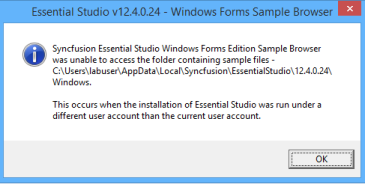

# How to overcome Sample Browser Access Denied error for Non-Admin User?

When an Administrator installs Essential Studio on a machine, a non-admin user cannot launch the Sample Browser from the Syncfusion Control Panel because this action attempts to access the Admin folder, where the samples are installed. The message box shown below appears.

To overcome this error, the Administrator should give access privileges to the folder path, for the non-admin user.
