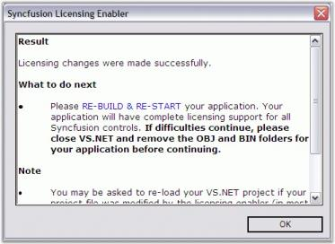
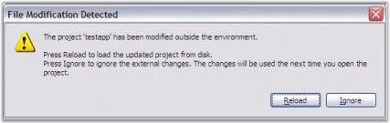

# How to remove the licensing error that pops up each time the application is run?

## Resolving the licensing issues for the Syncfusion versions before 8.2.0.x

When your project has been referred with older Syncfusion version assemblies before v8.2, follow the given steps to resolve the licensing error.

The following information provides troubleshooting tips that help you configure the system for a specific version of Syncfusion Essential Studio, and to avoid common licensing issues due to version conflicts.

1. Open the project in any text editor and ensure that only one Syncfusion.Core entry is referenced. When more than one entry is available, remove it.
2. Reload the application and then remove the bin and obj folders. 
3. Ensure that the assemblies referred in the project belong to the same version.
4. Recompile your project and run it.
5. In the Solution Explorer, click Show All Files. 
6. A file called licenses.licx__with the following entry is available in the project tree. 
* Syncfusion.Core.Licensing.LicensedComponent
* Syncfusion.Core. 
7. Add the file to the project.
8. Open the Properties of this file. 
9. Set the BuildAction property to Embedded Resource.
10. Run the project.

###  Embedding the License.licx file

The following steps help you to embed the License.licx file as an embedded resource in the project.

1. Open the project.
2. In the Solution Explorer, right-click on the Project node and then select Add New Item.
3. Choose the License.licx file from the following location:
  **Location:** {ProgramFilesFolder}\Syncfusion\Essential Studio\(version)\Templates\licenses.licx file.

4. The file is added. 
5. In the Solution Explorer, click the License file node and then open the Properties window.
6. Set the Build Action property to Embedded Resource.
   
   

7. A Licensing Error message opens. 
   
   

8. Click Fix It.

9. The Syncfusion Licensing Enabler dialog box opens. 
   
   

10. Click OK.

11. The File Modification Detected dialog box opens. 
    
	

12. Click Reload. 

    This message appears because the .exe.licenses file shown in the following screenshot has been modified to include the Syncfusion licensing information. To embed this information into the output EXE, you must rebuild the application. Verify whether this file has the Syncfusion version information you have the license to. If the file has information for any other version, every time you run the application, the Licensing Error message will appear.  
    
	

13. Rebuild and run the application again. The above mentioned messages are no longer displayed.

## Resolving the licensing issues for the Syncfusion versions from 8.2.0.x to 13.1.0.x

When your project has been referred with Syncfusion version assemblies from v8.2 to 13.1, follow the given steps to resolve the licensing error.

Syncfusion removed run-time licensing, for all Essential Studio products, from the version 8.2.0.x. So it is not required to embed the license.licx file in your project. Remove the license.licx file from the project, when it has already been added.
 

The following steps are provided to resolve the licensing issues for the Syncfusion versions from **8.2 to 13.1:**

1. Ensure that the Unlock Key for the respective version, has been installed properly in the registry using the License Manager utility from the Dashboard.
   
   

2. Open your Visual Studio Project file in a text editor and ensure that only one Syncfusion.Core reference entry exists in your project.
   
   

3. When more than one Syncfusion.Core entry exists in your project, remove those entries.

4. Reload your project in Visual Studio.

5. Set the Copy as Local and set the Specific Version property to True for all Syncfusion referenced assemblies.
   
   

6. Rebuild your application.

## Licensing information for the Syncfusion versions from v13.2.0.29 and later

Syncfusion has removed the Syncfusion.Core dependency for all the Essential Studio products from v13.2.0.29. So, it is not required to refer the Syncfusion.Core assembly in your project, when you are using Syncfusion v13.2.0.29 or later versions. If Syncfusion.Core assembly already added in your projects, then it should be removed.

Also, Syncfusion has removed run-time licensing for all Essential Studio products from the version 8.2.0.x. So, it is not required to embed the license.licx file in your project, if you are using v8.2 or later. Remove the license.licx file from your project, if it has been already added.