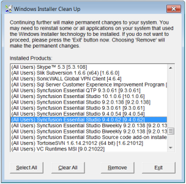

# How to uninstall the Syncfusion Installer manually?

Sometimes, installation may crash due to the machine getting switched off during installation or for other reasons. In such cases, the Uninstall utility is not available. The following are the steps to uninstall manually:

1. Download and install the **Windows Installer Cleanup** utility from the following link:  [Windows Installer Cleanup](http://files2.syncfusion.com/Installs/Support/KB/msicuu2.exe).
2. Remove Syncfusion’s product-related installers, for the version you are trying to uninstall, using the Windows Installer Cleanup utility.

   

3. Manually remove or delete the installed Syncfusion files from the following location.

   **Source (Windows XP, Windows Vista, Windows 7):** (Installed location)\ Syncfusion\Essential Studio\ (version)

   **Example:** C:\Program Files\Syncfusion\Essential Studio\9.4.0.62

   **Samples (Windows XP):** C:\Syncfusion\(version)

   **Example:** C:\Syncfusion\9.4.0.62

   **Samples (Windows Vista, Windows 7):** C:\Users\(user name)\AppData\Local\Syncfusion\EssentialStudio\ (version)

   **Example:** C:\Users\(user name)\AppData\Local\Syncfusion\EssentialStudio\9.4.0.62

   N> Sample locations mentioned above is default for corresponding OS. When you have installed samples in any other location, remove it from that location.

4. Essential Studio is uninstalled. You can install it again.
