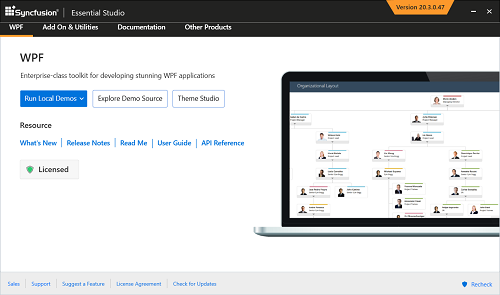

# What is the role of Essential Studio in Visual Studio?

Syncfusion Essential Studio is not a plug-in for Visual Studio or an IDE like Visual Studio. Syncfusion Essential Studio is a .NET based product which offers 800+ controls and frameworks which can be used in Visual Studio for developing stunning applications. The Essential Studio setup includes the samples for all the controls which provides an overview of how Syncfusion controls looks like and how it works. The platforms that comes with Syncfusion Essential Studio are as follows.

* ASP.NET 
* ASP.NET Core (Essential JS 1)
* ASP.NET MVC (Essential JS 1)
* JavaScript (Essential JS 1)
* JSP
* PHP
* Universal Windows Platform
* Windows Forms 
* WPF
* Xamarin
* FileFormats
* ASP.NET Core (Essential JS 2)
* ASP.NET MVC (Essential JS 2)
* JavaScript (Essential JS 2)

Syncfusion Essential Studio offers Syncfusion Control Panel from which both the online and offline samples can be viewed for all the controls. Documentation, Read Me and Release Notes can also be viewed from the dashboard itself which reduces the burden of searching over the web.  

Apart from the installer for Windows, Syncfusion also provides the installer for Mac for the following Essential Studio platforms.

1. ASP.NET Core (Essential JS 1)
2. JavaScript (Essential JS 1)
3. Xamarin
4. PHP
5. Electron
6. WebKit HTML Converter
7. ASP.NET Core (Essential JS 2)
8. JavaScript (Essential JS 2)

Download and install the latest Essential Studio setup from [here](https://www.syncfusion.com/downloads/latest-version).

Refer [this](https://help.syncfusion.com/common/essential-studio/essential-studio-enterprise-installer#step-by-step-installation) link for the step by step installation of Syncfusion Essential Studio setup. 

After installing the Essential Studio setup, refer [this](https://help.syncfusion.com/) link for using the Syncfusion controls in Visual Studio for various platforms.  

Also, refer [this](http://www.syncfusion.com/downloads/support/directtrac/185893/ze/Essential_Studio_WhitePaper-1896020245) document for the general questions which pop ups to your mind while installing the Syncfusion Essential Studio setup.

