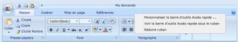

### Silverlight

In Silverlight, the easiest way to accomplish localization is to use a Resource (.resx) file. For each culture you want to target, you need a separate set of resources that match that specific culture. 

The following are the primary steps for localizing the Syncfusion Ribbon Control.

* Add Resources for different cultures.
* Add supported cultures.
* Assign a Current UI Culture to the application.

Add Resources

To localize Syncfusion Silverlight controls, you need to create resource files for each culture. 

The following steps illustrate this:

1. Add Resource (.resx) files in the Resources folder for different cultures. Here, .resx files in a different culture or invariant culture should be placed in the Resources folder of your project.
1. Resource files should be named as AssemblyName.CultureName.resx and AssemblyName.resx for the invariant culture, where
* AssemblyName – Syncfusion Silverlight Control Assembly Name.
* CultureName – Culture Code of the resource that you want to show in the UI. 

When your conversion is only for the invariant culture, the .resx file does not have to contain a culture suffix.

Example:

* Syncfusion.Ribbon.Silverlight.fr-FR.resx – French resource for Syncfusion.Ribbon.Silverlight assembly.
* Syncfusion.Ribbon.Silverlight.resx – Invariant Culture resource for Syncfusion.Ribbon.Silverlight assembly.

Add Supported Cultures

It is very important to add supported cultures in the sample application project before you run the application.

Follow the steps provided to localize strings for your culture:

1. In the Solution Explorer, right-click your sample application project and choose Unload Project. The project is unavailable.
2. Right-click the project again, and select the Edit__SampleProjectName.csproj option.
3. In the _._csproj file, find the _&lt;SupportedCultures&gt;__&lt;/SupportedCultures&gt;___tags. By default, the tags are empty. So, add the cultures that you want to be supported, separated by a semicolon.

Example: <SupportedCultures>fr-FR &lt;/SupportedCultures&gt;

4. Save the project and reload it by right-clicking the SampleProjectName.csproj__and choosing Reload SampleProjectName.csproj_._

Assign Current UI Culture to the Application

By default, the Current Culture is en_-_US. You can change the CurrentUICulture. Here, CurentUICulture should be set beforethe IntializeComponent in your StartUp page, here, MainPage.xaml.cs, or you can do it in App.xaml.cs in the Application_Startup event.

C# (MainPage.xaml.cs) 

public MainPage()

(

System.Threading.Thread.CurrentThread.CurrentUICulture = new System.Globalization.CultureInfo("fr-FR");

InitializeComponent();

)

Alternatively,

C# (App.xaml.cs) 

private void Application_Startup(object sender, StartupEventArgs e)

(

System.Threading.Thread.CurrentThread.CurrentUICulture = new System.Globalization.CultureInfo("fr-FR");

this.RootVisual = new MainPage();

)

The following screenshots illustrate the Ribbon Control with various culture options:

{:.image }

{:.image }

__

{:.image }

{:.image }

