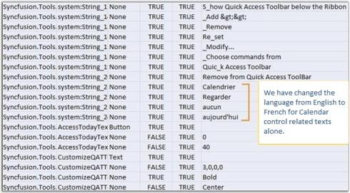
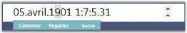

### WPF

You can use this satellite assembly to utilize the localization support for your culture. The following steps help you extract the resource strings to a .csv file using the LocBaml.exe file, as a major part of enabling localization.

The Syncfusion.Tools.WPF.Resources.dll is sufficient to generate the localization support for the Syncfusion controls. This assembly is available in the following installation location:

(Installed_location)\Syncfusion\Essential Studio\&lt;Version Number&gt;\Assemblies\3.5

1. Download the LocBaml.exe file from the following location:

   [http://files.syncfusion.com/support/Tools.WPF/UG/LocBaml.zip](http://files.syncfusion.com/support/Tools.WPF/UG/LocBaml.zip)

2. Copy the exe file and the Syncfusion.Tools.WPF.Resources.dll to the following location:

   &lt;Your Application&gt;\bin\Debug\en-US 

3. Open the Command Prompt and navigate to the same directory.

4. Use the following command to generate the .csv file from the existing Syncfusion.Tools.WPF.Resources.dll:

  (Your Application)\bin\Debug\en-US \LocBaml /parse Syncfusion.Tools.WPF.Resources.dll /out:resourceStrings.csv
  
  _Note: The .csv files can be edited via MS Excel or Notepad. This file contains string resources with the default text in the English language._ 

5. Open the .csv file using MS Excel or Notepad, and change the texts based on your culture. 

   The following illustrates customization from English to French.

   

6. Generate the localized satellite assembly using the modified .csv file and install in the application. 

7. Open Command Prompt, and navigate to the en-US directory. 

8. Create another directory fr-CH under Bin\Debug folder using the fr-CH command.
 

   _Note: The Directory name should follow a proper culture name._

9. Generate your own culture-specific assembly using the following command from en-US folder:

   LocBaml /generate /tran: resourceStrings.csv /out:../fr-CH /cul:fr-CH Syncfusion.Tools.WPF.Resources.dll

   Now you can see the generated satellite assembly under the fr-CH folder. 

10. Run your application with the CurrentUICulture as fr-CH in the App.xaml files as shown in the following code:
    
	~~~ cs
	[C#]
	public App()
	(
	Thread.CurrentThread.CurrentUICulture = new System.Globalization.CultureInfo("fr-FR");
	Thread.CurrentThread.CurrentCulture = new System.Globalization.CultureInfo("fr-FR");
	)
	~~~
	{:.prettyprint}
	
At the end of this process, the application should contain the following to achieve localization: 

* Your Application.exe file
* The en-US directory with Resources.dll
* The fr-CH directory with corresponding Resources.dll and Syncfusion Assemblies, when you have set CopyLocal to True.

### Calendar control in French language

The following image illustrates Calendar control in the French language.

_Note:_ 

> * _Localized strings are not displayed in your application until the created satellite assembly is signed. Send in your newly created assemblies for signing. Your assemblies are signed and sent immediately._
> * _It is not required to install satellite assemblies in the GAC or Assemblies folder._
> * _Your en-US directory should contain the default satellite assembly, available in the Precompiled Assemblies or Assemblies folder._
> * _Application culture change should be included before the InitializeComponent() method call in the application. It is better to include culture change in the App.xaml file._
