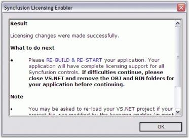
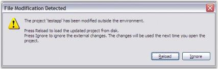

### Resolving the licensing Issues for the older Syncfusion versions Applicable to all older Syncfusion versions before 8.2.0.x

When your project has been referred with older Syncfusion version assemblies before v8.2, follow the given steps to resolve the licensing error.

The following information provides troubleshooting tips that help you configure the system for a specific version of Syncfusion Essential Studio, and to avoid common licensing issues due to version conflicts.

1. Open the project in any text editor and ensure that only one Syncfusion.Core entry is referenced. When more than one entry is available, remove it.
2. Reload the application and then remove the bin and obj folders. 
3. Ensure that the assemblies referred in the project belong to the same version.
4. Recompile your project and run it.
5. In the Solution Explorer, click Show All Files. 
6. A file called licenses.licx__with the following entry is available in the project tree. 
* Syncfusion.Core.Licensing.LicensedComponent
* Syncfusion.Core. 
7. Add the file to the project.
8. Open the Properties of this file. 
9. Set the BuildAction property to Embedded Resource.
10. Run the project.

### Embedding the License.licx file

The following steps help you to embed the License.licx file as an embedded resource in the project.

1. Open the project.
2. In the Solution Explorer, right-click on the Project node and then select Add New Item.
3. Choose the License.licx file from the following location:
  (Installed Drive):\Program Files\Syncfusion\Essential Studio\(version)\Templates\licenses.licx file.

4. The file is added. 
5. In the Solution Explorer, click the License file node and then open the Properties window.
6. Set the Build Action property to Embedded Resource.
   
   

7. A Licensing Error message opens. 
   
   

8. Click Fix It.

9. The Syncfusion Licensing Enabler dialog box opens. 
   
   

10. Click OK.

11. The File Modification Detected dialog box opens. 
    
	

12. Click Reload. 

    This message appears because the .exe.licenses file shown in the following screenshot has been modified to include the Syncfusion licensing information. To embed this information into the output exe, you must rebuild the application. Verify whether this file has the Syncfusion version information you have the license to. If the file has information for any other version, every time you run the application, the Licensing Error message will appear.  
    
	

13. Rebuild and run the application again. The above mentioned messages are no longer displayed.
