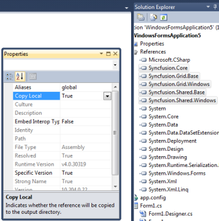

### Resolving the licensing issues for the Syncfusion versions Applicable to all Syncfusion versions from 8.2.0.x to 13.1.0.x

When your project has been referred with Syncfusion version assemblies from v8.2 to 13.1, follow the given steps to resolve the licensing error.

Syncfusion removed run-time licensing, for all Essential Studio products, from the version 8.2.0.x. to 13.1.0.x, so it is not required to embed the license.licx file in your project. Remove the license.licx file from the project, when it has already been added.

Syncfusion has removed the Syncfusion.Core dependency for all the Essential Studio products from the version 13.2.0.29. So, it is not required to refer to the Syncfusion.Core assembly in your project when you are using Syncfusion v13.2.0.29 or the later versions. 

If Syncfusion.Core assembly already added then should be removed from the project.

> 

The following steps are provided to resolve the licensing issues for the Syncfusion versions from 8.2 to 13.1:

1. Ensure that the Unlock Key for the respective version, has been installed properly in the registry using the License Manager utility from the Dashboard.

{:.image }

1. Open your Visual Studio Project file in a text editor and ensure that only one Syncfusion.Core reference entry exists in your project.

{:.image }

2. When more than one Syncfusion.Core entry exists in your project, remove those entries.
3. Reload your project in Visual Studio.
4. Set the Copy as Local and set the Specific Version property to True for all Syncfusion referenced assemblies.

{:.image }

5. Rebuild your application.
