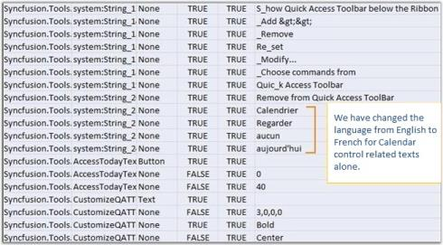

### WPF

You can use this satellite assembly to utilize the localization support for your culture. The following steps help you extract the resource strings to a .csv file using the LocBaml.exe file, as a major part of enabling localization.

The Syncfusion.Tools.WPF.Resources.dll is sufficient to generate the localization support for the Syncfusion controls. This assembly is available in the following installation location:

(Installed_location)\Syncfusion\Essential Studio\&lt;Version Number&gt;\Assemblies\3.5

1. Download the LocBaml.exe file from the following location:

[http://files.syncfusion.com/support/Tools.WPF/UG/LocBaml.zip](http://files.syncfusion.com/support/Tools.WPF/UG/LocBaml.zip)

1. Copy the exe file and the Syncfusion.Tools.WPF.Resources.dll to the following location:

&lt;Your Application&gt;\bin\Debug\en-US 

2. Open the Command Prompt and navigate to the same directory.
3. Use the following command to generate the .csv file from the existing Syncfusion.Tools.WPF.Resources.dll:

(Your Application)\bin\Debug\en-US \LocBaml /parse Syncfusion.Tools.WPF.Resources.dll /out:resourceStrings.csv

> 
{:.image }
_Note: The .csv files can be edited via MS Excel or Notepad. This file contains string resources with the default text in the English language._ 

4. Open the .csv file using MS Excel or Notepad, and change the texts based on your culture. 

The following illustrates customization from English to French.

{:.image }

5. Generate the localized satellite assembly using the modified .csv file and install in the application. 
6. Open Command Prompt, and navigate to the en-US directory. 
7. Create another directory fr-CH under Bin\Debug folder using the fr-CH command.
> 

> 
{:.image }
_Note: The Directory name should follow a proper culture name._

8. Generate your own culture-specific assembly using the following command from en-US folder:

LocBaml /generate /tran: resourceStrings.csv /out:../fr-CH /cul:fr-CH Syncfusion.Tools.WPF.Resources.dll

Now you can see the generated satellite assembly under the fr-CH folder. 

9. Run your application with the CurrentUICulture as fr-CH in the App.xaml files as shown in the following code:

[C#]

public App()

(

Thread.CurrentThread.CurrentUICulture = new System.Globalization.CultureInfo("fr-FR");

Thread.CurrentThread.CurrentCulture = new System.Globalization.CultureInfo("fr-FR");

)

At the end of this process, the application should contain the following to achieve localization: 

* Your Application.exe file
* The en-US directory with Resources.dll
* The fr-CH directory with corresponding Resources.dll and Syncfusion Assemblies, when you have set CopyLocal to True.

Calendar control in French language

The following image illustrates Calendar control in the French language.

{:.image }

> 
{:.image }
_Note:_ 

> * _Localized strings are not displayed in your application until the created satellite assembly is signed. Send in your newly created assemblies for signing. Your assemblies are signed and sent immediately._
> * _It is not required to install satellite assemblies in the GAC or Assemblies folder._
> * _Your en-US directory should contain the default satellite assembly, available in the Precompiled Assemblies or Assemblies folder._
> * _Application culture change should be included before the InitializeComponent() method call in the application. It is better to include culture change in the App.xaml file._
