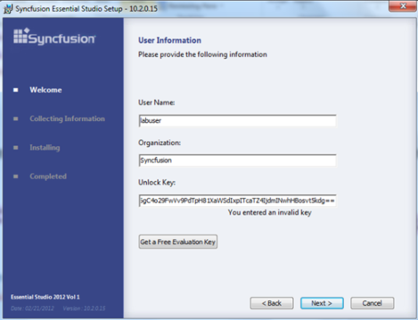
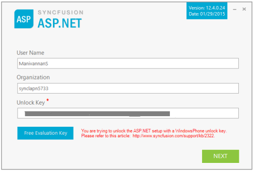
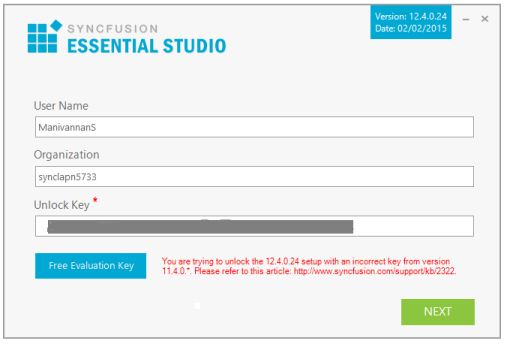

## Why is the Unlock Key displayed as Invalid while installing the setup?

Unlock Key can be validated as invalid for two reasons. They are:

* When you install a particular version’s setup with another version’s unlock key. Ensure that you enter the unlock key for that respective version.
* Some part of the unlock key code could have been altered or removed while copying the unlock key. Ensure that you copy the entire key without any spacing. 

  #### Earlier version of 11.1.*.*

  

  #### Newer version of 10.4.*.*

  

  

When you get the above key information wrong, then you need to provide the specified version and platform key. 

You can get licensed key by logging on to your Support Account in Direct-Trac and going to the Product Downloads and Keys page from the Direct-Trac Customer Dashboard. You must choose version x.x.x.x from the Get Your Key Here drop-down box, so that you can get your key for this release.