### Step-by-Step Installation

The following are the steps to install the Metro Studio Setup.

1. Double-click the Syncfusion Metro Studio Installer Setup file. The Syncfusion Metro Studio Installer Wizard opens.

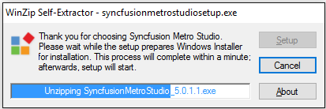
{:.image }

1. Click Next.

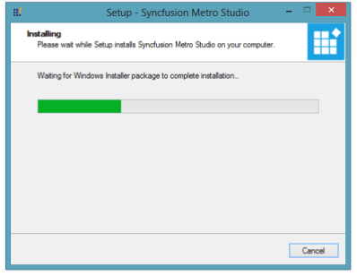
{:.image }

2. When the unzip operation is complete, the Syncfusion Metro Studio Setup dialog box opens.

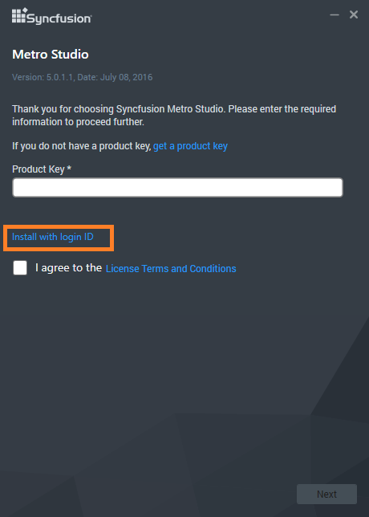
{:.image }

3. Click Next. The User Information screen opens.

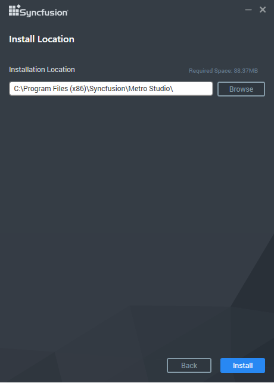
{:.image }

4. Enter your User Name, Organization and Unlock Key in the corresponding text boxes provided.
5. Click Next.

> 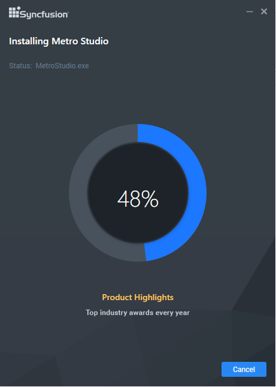
{:.image }
_Note: The Unlock Key is validated and the welcome screen opens._

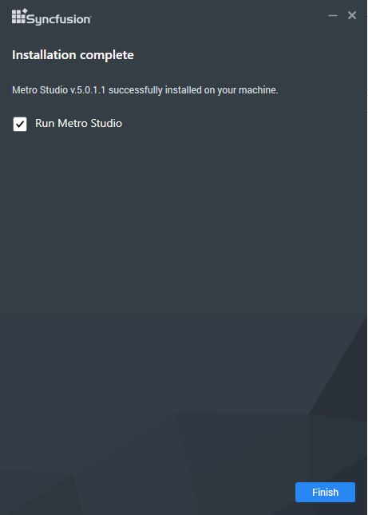
{:.image }

6. Click Next. The License Agreement screen opens.

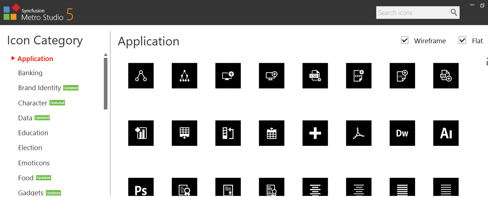
{:.image }

7. After reading the terms, click the I accept the terms in the License Agreement option.
8. Click Next. Then Select the Installation folder screen opens.

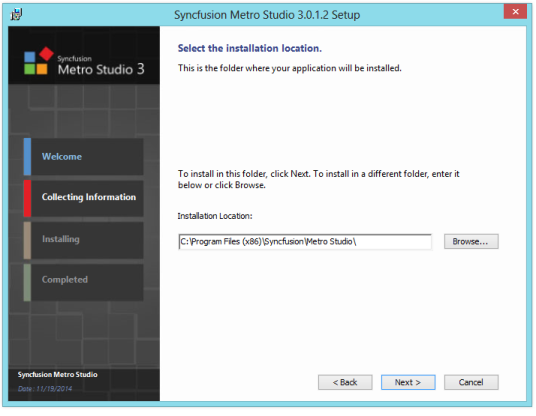
{:.image }

9. Click Next. The Ready to Install dialog opens.

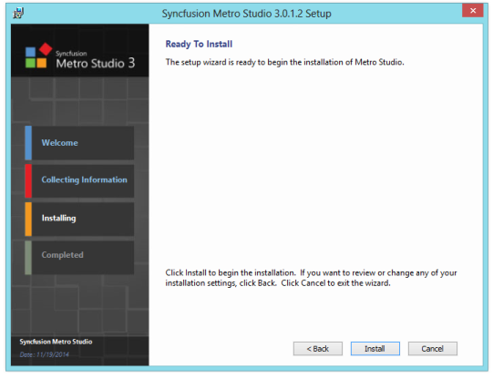
{:.image }

10. Click Install to continue with the installation.

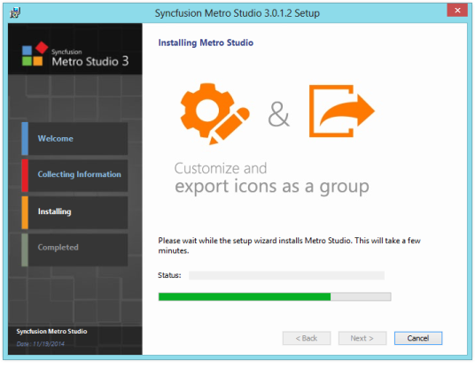
{:.image }

> 
{:.image }
_Note: The completed screen is displayed once the selected package is installed._

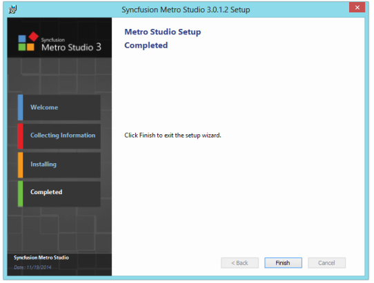
{:.image }

11. Click Finish to exit the Setup Wizard. This initiates the installation of the Syncfusion Metro Studio Installer on your computer.

> 
{:.image }
_Note: The Syncfusion Metro Studio Installer is installed on your computer, and you are informed with a dialog box, when the installation is complete._

{:.image }

12. Once the Metro Studio Source Code Add-on is installed, Metro Studio Dashboard provides the option to create icons.

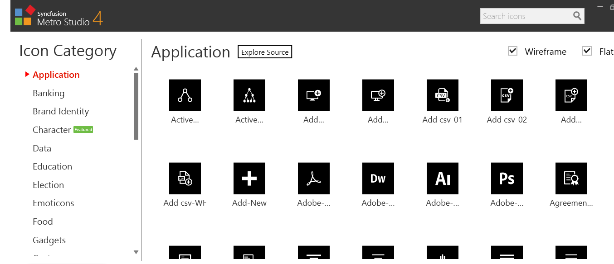
{:.image }

