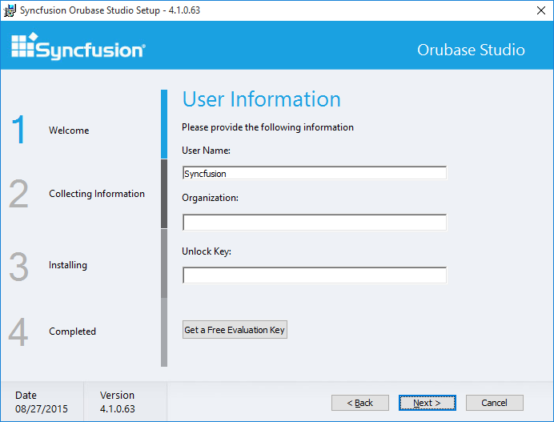
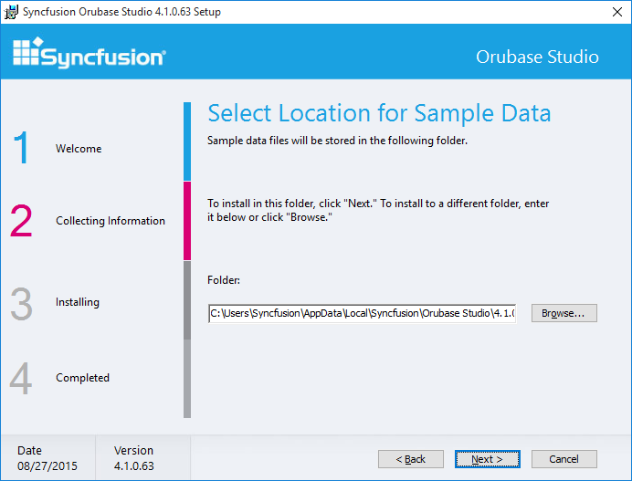
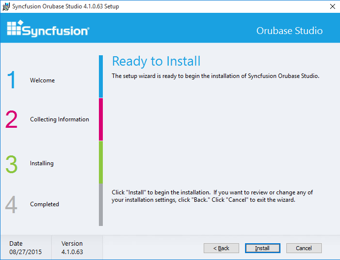

### Step-by-Step Installation

The following procedure illustrates how to install the Orubase Studio setup.

1. Double-click the Syncfusion Orubase Setup file. The Self-ExtractorWizard opens and extracts the package automatically. 

{:.image }

1. When the unzip operation is complete, the Syncfusion Orubase Studio Setup dialog box opens.

{:.image }

2. Click Next. The User Information screen opens.

{:.image }

3. Enter User Name, Organization and Unlock Key in the corresponding text boxes provided.
4. Click Next.

> 
{:.image }
_Note: The Unlock Key is validated and the License Agreement screen opens._

{:.image }

5. On accepting the terms, click I accept the terms in the License Agreement option.
6. Click Next. The Select the Installation Folder screen opens.

{:.image }

7. Click Next. The Select the Samples Folder screen opens.

{:.image }

> 
{:.image }
_Note: You can also browse to choose a location by clicking Browse._

8. Click Next to get the Ready to Install dialog box.

{:.image }

9. Click Install to continue with the installation.

{:.image }

> 
{:.image }
_Note: The completed screen is displayed once the selected package is installed._

{:.image }

10. Click Finish to exit the Setup Wizard. Open the Orubase Dashboard by selecting Run Dashboard.

{:.image }

Run Dashboard Samples:

{:.image }

