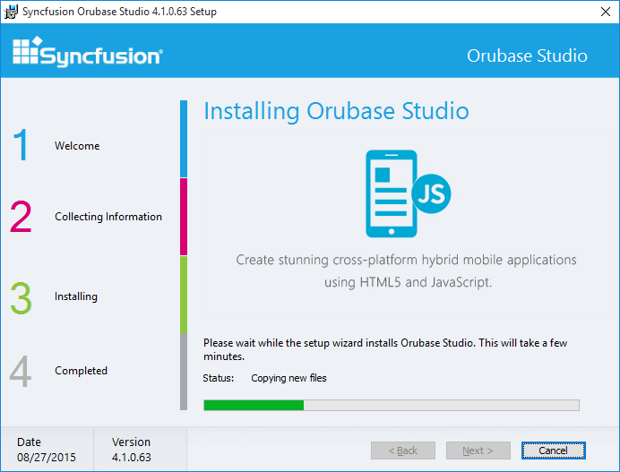
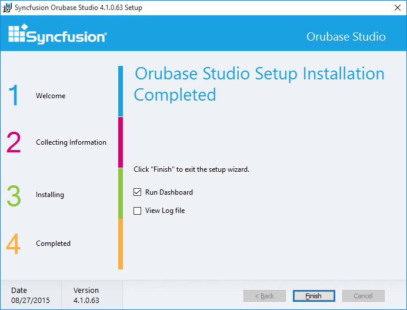

# Step-by-Step Installation

The following procedure illustrates how to install the Orubase Studio setup.

1. Double-click the Syncfusion Orubase Setup file. The Self-ExtractorWizard opens and extracts the package automatically. 
   
   

2. When the unzip operation is complete, the Syncfusion Orubase Studio Setup dialog box opens.

   

3. Click Next. The User Information screen opens.

   

4. Enter User Name, Organization and Unlock Key in the corresponding text boxes provided.

5. Click Next.

   > Note: The Unlock Key is validated and the License Agreement screen opens.

   

6. On accepting the terms, click I accept the terms in the License Agreement option.

7. Click Next. The Select the Installation Folder screen opens.

   

8. Click Next. The Select the Samples Folder screen opens.

   

   > Note: You can also browse to choose a location by clicking Browse.

9. Click Next to get the Ready to Install dialog box.

   

10. Click Install to continue with the installation.

    

    > Note: The completed screen is displayed once the selected package is installed.

    

11. Click Finish to exit the Setup Wizard. Open the Orubase Dashboard by selecting Run Dashboard.

    

    ### Run Dashboard Samples:

    

